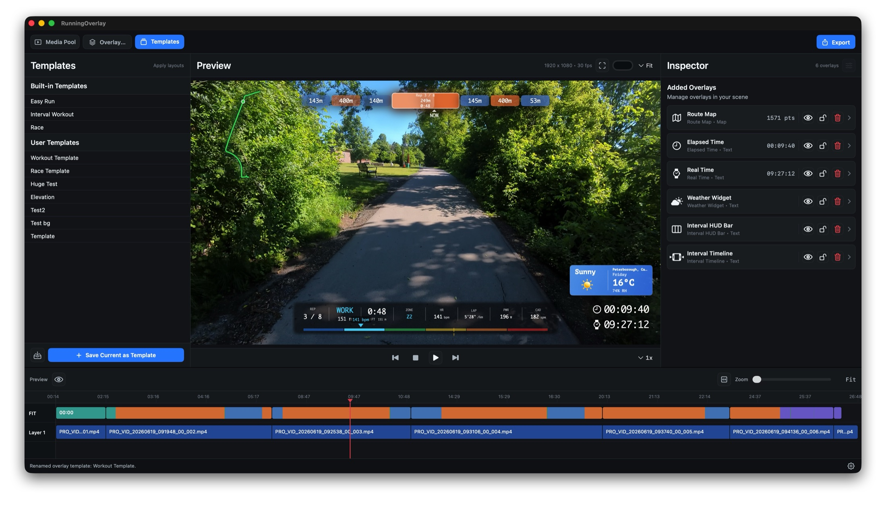
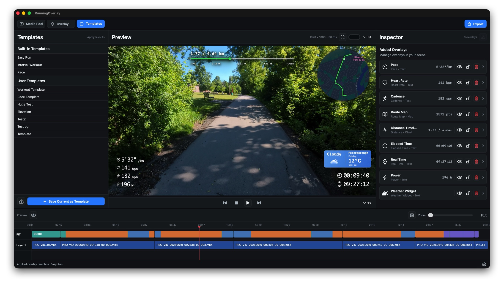

# Running Overlay

Running Overlay is a native macOS editor for turning FIT activity data into
customizable, transparent sports-data overlay videos.

> **Source-available:** You may download, build, study, modify, and use Running
> Overlay under the [PolyForm Shield License 1.0.0](LICENSE). Providing a
> competing product or service requires a
> [separate commercial license](COMMERCIAL-LICENSE.md).

Import an activity and its source videos, align them on a shared timeline,
design reusable overlays, preview the result over video, and export alpha MOV
files for Final Cut Pro, DaVinci Resolve, Premiere Pro, or another editor.

> Status: active development. Core editing and export workflows are usable,
> but project formats and UI behavior may still change before the first stable
> release.





## Highlights

- Native macOS SwiftUI editor with timeline-based video alignment.
- FIT metrics including pace, heart rate, distance, elevation, cadence, power,
  calories, temperature, grade, and running dynamics when available.
- Route maps, distance/elevation charts, interval HUDs and timelines, running
  gauges, weather widgets, zone bars, and configurable numeric overlays.
- Reusable built-in and user-authored overlay templates.
- Shared preview/export rendering for consistent visual output.
- Transparent MOV export using H.265 with alpha or ProRes 4444.
- Batch export per timeline clip or one full-activity overlay.
- Local processing by default; optional weather requests are documented in
  [PRIVACY.md](PRIVACY.md).

## Workflow

1. Import a FIT activity file.
2. Import one or more videos and match or manually align them on the timeline.
3. Add overlays individually or apply a reusable template.
4. Adjust layout, typography, colors, data units, and visual effects.
5. Preview against the source video and export transparent overlay clips.

## Requirements and Current Limits

- macOS 15 or newer
- Swift 6 toolchain
- A FIT file with record data for activity-driven overlays
- H.265 alpha or ProRes 4444 support for transparent MOV export

Current limitations:

- FIT profile coverage is focused on fields used by the editor rather than the
  entire FIT specification.
- Video metadata varies by camera, so some clips require manual alignment.
- HEVC-with-alpha availability depends on the Mac and selected export settings.
- The repository currently provides source builds; packaged signed releases
  are not available yet.

## Build from Source

```sh
git clone https://github.com/zijianwang90/running_overlay.git
cd running_overlay
swift run RunningOverlay
```

Run the complete validation suite:

```sh
./scripts/check.sh
```

## Documentation

- [Documentation Index](docs/index.md)
- [Product Requirements](docs/requirements.md)
- [Development Guide](docs/development.md)
- [Architecture Notes](docs/architecture.md)
- [Roadmap](docs/roadmap.md)
- [Featured Overlay Modules](docs/overlay-modules/)
- [Project Log](docs/project-log.md)
- [Decision Records](docs/adr/)

## Contributing

Human-authored and AI-assisted contributions are welcome. Start with
[AGENTS.md](AGENTS.md) and [the contribution guide](CONTRIBUTING.md).

Run the full local validation suite with:

```sh
./scripts/check.sh
```

Support is best-effort; see [SUPPORT.md](SUPPORT.md). Running Overlay handles
sensitive activity and location data, so review [PRIVACY.md](PRIVACY.md)
before sharing project files or issue attachments.

## Support the Project

Running Overlay is developed independently. If the project saves you time,
you can support its ongoing development. Buy Me a Coffee is the preferred
option; WeChat Pay and Alipay are also available.

<table align="center">
  <tr>
    <th>Buy Me a Coffee (preferred)</th>
    <th>WeChat Pay</th>
    <th>Alipay</th>
  </tr>
  <tr>
    <td align="center" valign="middle">
      <a href="https://buymeacoffee.com/zijianwang90">
        <strong>☕ Support Running Overlay</strong>
      </a>
    </td>
    <td align="center">
      
    </td>
    <td align="center">
      
    </td>
  </tr>
</table>

## License

Running Overlay is source-available under the
[PolyForm Shield License 1.0.0](LICENSE). The license permits personal,
educational, internal, and non-competing commercial use, but does not permit
providing a product that competes with Running Overlay.

- [Commercial licensing](COMMERCIAL-LICENSE.md)
- [Trademark policy](TRADEMARKS.md)
- [Contributor License Agreement](CLA.md)

Videos and other media created with Running Overlay are not restricted by the
software license.

See [third-party notices](THIRD_PARTY_NOTICES.md) for dependency and asset
provenance.

## Documentation Rule

Every meaningful product or engineering change should update the relevant documents in the same development step:

- Requirements changes go into `docs/requirements.md`.
- Implementation decisions and engineering notes go into the relevant guide
  linked from `docs/development.md`, or into `docs/architecture.md`.
- Milestone progress goes into `docs/roadmap.md`.
- Work history goes into the current monthly file linked from
  `docs/project-log.md`.
- Decisions that affect future work get an ADR under `docs/adr/`.
