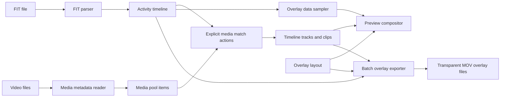

# Running Overlay Architecture Notes

Last updated: 2026-04-29

## 1. Architecture Goal

The app should separate activity data, media timing, timeline editing, overlay design, preview playback, and export rendering so that UI work does not compromise timing accuracy.

## 2. High-Level Data Flow

## 3. Subsystems

### FIT Data

Responsibilities:

- Decode FIT records (message type 20) and lap messages (message type 19).
- Preserve activity timestamps.
- Normalize metrics into app-level records: heart rate, cadence, pace, distance, elevation, power, calories, GPS coordinates, running dynamics (vertical oscillation, ground contact time, stride length, ground contact balance), temperature, grade.
- Parse lap structure into `LapRecord` arrays with kind classification (warmup / active / rest / cooldown).
- Provide time-based sampling and lap-based queries (`currentLap`, `lapElapsedTime`, `lapProgress`) for UI preview and export.

Non-responsibilities:

- UI formatting.
- Media alignment policy.
- Export rendering.

### Media Import

Responsibilities:

- Import video file references into the media pool.
- Read duration, creation time, timecode, and other useful metadata.
- Parse filename time patterns.
- Group clips by likely camera/source when possible.
- Track media-pool selection state, user-facing tag marks, and whether an item is ready for timestamp matching.

Non-responsibilities:

- Automatic timeline placement on import.
- Final timeline edit decisions.
- Overlay rendering.
- Shared overlay render layout generation for preview and export.

### Alignment Engine

Responsibilities:

- Map selected media items onto the activity timeline when the user explicitly requests matching.
- Record confidence and source of alignment.
- Support manual correction and camera-level offsets.

Important rule:

- Alignment output must be stored as time values. Timeline pixels are only a view.

### Timeline

Responsibilities:

- Own tracks, clips, playhead, zoom, selection, and edit commands.
- Convert time to screen coordinates for display.
- Provide a collapsed display-time mapping that can hide no-video gaps without changing stored project-time clip positions.
- Preserve clip timing with precision independent of zoom level.
- Expose clip timing edits as time-domain commands, including precise start and alignment-offset updates from the Inspector.

### Overlay

Responsibilities:

- Store overlay element type, position, scale, and style.
- Bind overlay elements to sampled activity data.
- Provide renderable overlay state for preview and export.
- Keep Inspector controls model-backed; omit or disable controls such as visibility, lock, animation, generic opacity, and metric reassignment until those fields exist in the project schema.
- Provide addable overlay definitions to the left Overlay Pool; the right Inspector manages added overlays and edits selected overlay details.

Current overlay element types:

| Category | Types |
|---|---|
| Metrics | heartRate, pace, distance, elapsedTime, realTime, elevation, cadence, power, calories, verticalOscillation, groundContactTime, strideLength, verticalRatio, groundContactBalance, temperature, grade |
| Charts | distanceTimeline, elevationChart, runningGauge, lapList |
| Route | routeMap |

### Preview

Responsibilities:

- Display the current timeline time.
- Show source video where available.
- Support transient media-pool source preview that temporarily overrides timeline preview without changing timeline state.
- In collapsed timeline mode, skip hidden empty playback regions and continue playback from the next visible video span.
- Fit the project-resolution canvas into the available preview region.
- Composite editable overlay elements over that fitted canvas.
- Map overlay normalized positions, drag deltas, guides, and preview scale from the fitted canvas rather than the outer preview container.

### Export

Responsibilities:

- For each timeline clip, render a transparent MOV overlay clip matching that clip's activity start/end.
- Reuse the shared overlay frame renderer for MOV frames and PNG calibration frames.
- Apply project resolution, frame rate, and bitrate.
- Report progress and failures.

## 4. Timing Model

The app has multiple time domains:

- Real timestamp: wall-clock time from FIT records or media metadata.
- Activity elapsed time: offset from FIT activity start.
- Media source time: time inside a video file.
- Project timeline time: editable time used for video clips; it may be negative relative to FIT elapsed time.
- FIT axis time: activity elapsed time represented by a draggable FIT layer inside the project timeline.
- Render frame time: frame-indexed time during export.

Conversions must be explicit:

- Real timestamp to activity elapsed time.
- Media metadata timestamp to project timeline placement.
- Project timeline time to FIT elapsed time through `TimelineModel.fitStartTime`.
- Project timeline time to media source time.
- Timeline time to sampled activity record.
- Render frame index to timeline time.

## 5. Project File Direction

The project should eventually persist:

- Project settings.
- FIT file reference and parsed summary/cache metadata.
- Media file references, extracted metadata, media-pool tags, and match status.
- Timeline tracks and clip placements.
- Overlay layout and styles.
- Export presets when introduced.

The initial implementation can use a simple local document format, but the schema should be versioned from the beginning.

## 6. Known Technical Risks

- FIT parsing edge cases, including pauses, missing records, device time drift, and timezone behavior.
- Video metadata inconsistency across cameras and phones.
- Transparent MOV export codec support and alpha-channel correctness.
- Timeline performance for long activities and high zoom levels.
- Maintaining frame-accurate export while using user-friendly timeline interactions.
