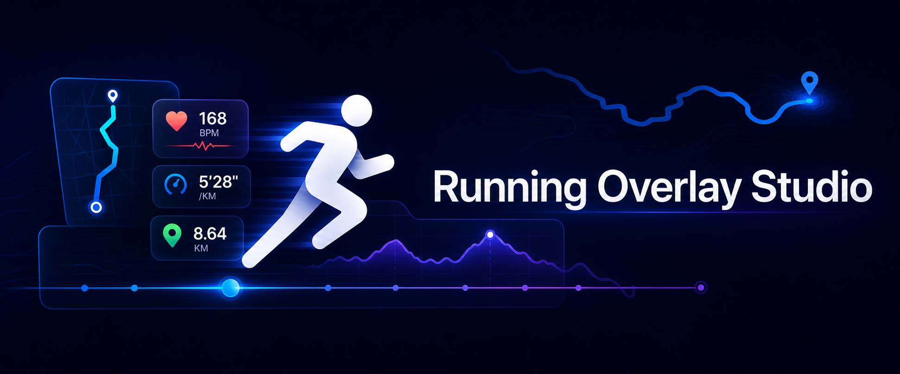
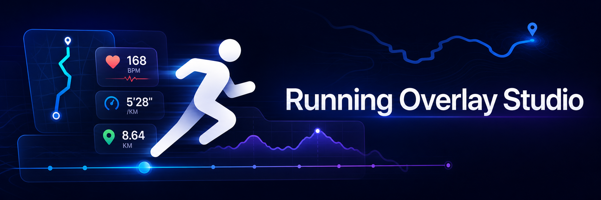

# Brand Design References

This directory collects exploratory brand artwork for Running Overlay Studio.
Concepts remain design references until they are explicitly approved for a
product, website, store listing, or social channel.

## Horizontal Banner Concept v2

- Canvas: 1942 × 809 pixels (approximately 12:5).
- Intended use: current README header and preferred compact direction for a
  website, repository, or social-profile header.
- Direction: recomposes the v1 running, metric, route, elevation, and timeline
  language for a narrower canvas, with the complete wordmark inside a larger
  safe area.
- Status: preferred exploratory direction; not yet a production or trademark
  lockup.
- Provenance: generated specifically for this project with OpenAI image
  generation on 2026-07-16, using v1 and a user-supplied crop guide as visual
  references. No third-party artwork was supplied.

## Horizontal Banner Concept v1

- Canvas: 2172 × 724 pixels (3:1).
- Intended use: early visual-direction review for a wide website, repository,
  or social-profile header.
- Direction: extends the App Icon's midnight navy, cyan, cobalt, violet, and
  white visual language into a horizontal running-data scene.
- Status: superseded exploratory direction, retained for comparison; not a
  production or trademark lockup.
- Provenance: generated specifically for this project with OpenAI image
  generation on 2026-07-16, using the repository App Icon as a visual
  reference. No third-party artwork was supplied.
