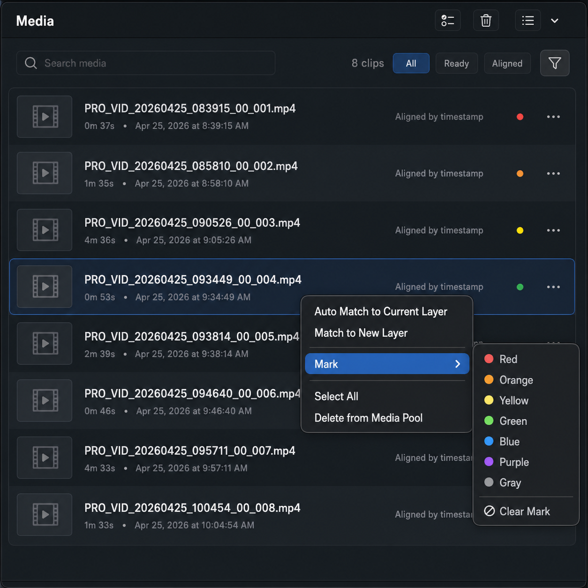
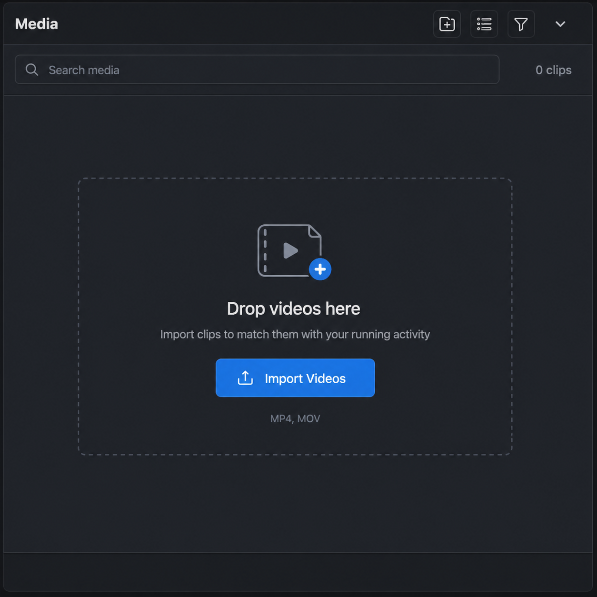

# Media Pool UI Design Spec

Last updated: 2026-04-26

## Purpose

The Media Pool is the left-side source bin for imported video files. It supports import visibility, selection, source preview, timestamp matching, tag filtering, and context-menu actions. This refresh aligns Media Pool styling with the Inspector design language documented in [Inspector UI Design Spec](./inspector-ui.md).

This spec is implementation-facing. Use it to restyle `MediaBrowserView` while preserving current behavior.

## Design Reference

## Design Direction

The Media Pool should feel like a professional video editor bin, not a generic system list. Keep the UI dense and scannable:

- Dark panel background with alternating row bands.
- Compact rows with clear filename, duration, capture time, and alignment status.
- Selected rows use a controlled blue/charcoal highlight, not a full washed-out system selection.
- Menus feel native to macOS but visually belong to the app: dark, elevated, rounded, bordered.
- Color marks are small, fast-to-scan dots or strips, not dominant labels.

Use the same app-level visual tokens as the Inspector where possible.

## Design Tokens

Prefer reusing shared tokens from `inspector-ui.md`. Media-specific values:

| Token | Hex / Value | Usage |
| --- | --- | --- |
| `media.panel` | `#15191D` | Media panel background |
| `media.header` | `#1B2025` | Header bar |
| `media.rowEven` | `#1B2025` | Alternating row |
| `media.rowOdd` | `#171C21` | Alternating row |
| `media.rowHover` | `#222932` | Hover row |
| `media.rowSelected` | `#263244` | Selected row |
| `media.rowSelectedBorder` | `#2F8CFF` | Selected row left or top accent |
| `media.menuBackground` | `#1D2228` | Context menu |
| `media.menuHover` | `#2F8CFF` | Active menu item |
| `media.thumbnailBackground` | `#101418` | Thumbnail/file icon well |
| `row.height` | `68-76 px` | Default media row height |
| `thumbnail.size` | `42x42 px` | Optional thumbnail/icon well |
| `toolbar.iconButton` | `30x30 px` | Header actions |
| `search.height` | `30 px` | Search/filter field |

Mark colors:

| Mark | Fill |
| --- | --- |
| Red | `#FF5A5F` |
| Orange | `#FF9342` |
| Yellow | `#FFD166` |
| Green | `#51C96B` |
| Blue | `#2F8CFF` |
| Purple | `#B657E8` |
| Gray | `#9EA3AA` |

## Current Implementation Mapping

Current SwiftUI entry point:

- `Sources/RunningOverlay/UI/MediaBrowserView.swift`

Existing behavior to preserve:

- Drag/drop video import.
- Single selection and Command-click multi-selection.
- Command+A selects all visible media when the Media Pool is active.
- Double-click previews a media-pool source item.
- Context menu actions:
  - `Auto Match to Current Layer`
  - `Match to New Layer`
  - `Mark`
  - `Select All`
  - `Delete from Media Pool`
- Tag filter menu.
- Alternating row backgrounds.
- Focus loss clears transient media-pool preview.

## Layout

Top to bottom:

1. Header bar
2. Search and filter strip
3. Media list
4. Empty states when needed

Recommended panel width: 300-380 px. The mockup is square for design transfer only.

## Header Bar

Content:

- Left title: `Media`
- Right toolbar icon buttons:
  - Select all visible media
  - Clear selection
  - View/filter menu
  - Dropdown chevron or additional options

Icon guidance:

- Use system symbols in SwiftUI if lucide is not available.
- Keep icon-only actions at 30x30 px.
- Add `.help(...)` and accessibility labels for every icon-only button.
- Disabled buttons should use muted foreground and no hover fill.

## Search And Filter Strip

Add a compact search field below or integrated into the header:

- Placeholder: `Search media`
- Height: 30 px
- Background: `control.background`
- Border: `border.subtle`

Status/filter row:

- Left: clip count, e.g. `8 clips`
- Filter chips: `All`, `Ready`, `Aligned`
- `All` selected by default.

Implementation note:

- The current model supports tag filtering but does not obviously expose a search query state or `Ready`/`Aligned` filters in the mockup form. It is acceptable to implement visual-ready structure incrementally:
  - Add search only if it filters `displayName`.
  - Keep existing tag filter menu if status chips are deferred.
  - Do not show filter chips that do not work.

## Media Rows

Each row contains:

- Optional thumbnail/file icon well on the left.
- Optional mark dot or mark strip.
- Primary filename.
- Secondary duration.
- Secondary capture date/time.
- Right-side alignment status, e.g. `Aligned by timestamp`.

Example filenames:

- `PRO_VID_20260425_083915_00_001.mp4`
- `PRO_VID_20260425_085810_00_002.mp4`
- `PRO_VID_20260425_090526_00_003.mp4`
- `PRO_VID_20260425_093449_00_004.mp4`
- `PRO_VID_20260425_093814_00_005.mp4`
- `PRO_VID_20260425_094640_00_006.mp4`
- `PRO_VID_20260425_095711_00_007.mp4`
- `PRO_VID_20260425_100454_00_008.mp4`

Row states:

- Default: alternating dark backgrounds.
- Hover: slightly elevated dark fill.
- Selected: `media.rowSelected` plus a subtle blue accent line or border.
- Multi-selected: same selected style per row.
- Source-previewed item may use an additional play indicator if needed, but do not confuse it with selection.

Text:

- Filename: 13 px semibold, primary text.
- Metadata: 11-12 px regular, secondary text.
- Alignment status: 11-12 px medium, secondary or muted text.
- Use monospaced digits for duration if it improves scanning.

## Context Menu

The context menu should remain functionally equivalent to the current SwiftUI `.contextMenu`.

Menu items:

1. `Auto Match to Current Layer`
2. `Match to New Layer`
3. Separator
4. `Mark` with chevron and submenu
5. Separator
6. `Select All`
7. `Delete from Media Pool`

Mark submenu:

- `Red`
- `Orange`
- `Yellow`
- `Green`
- `Blue`
- `Purple`
- `Gray`
- `Clear Mark`

Submenu visual:

- Add color dots beside color names when feasible.
- The hovered menu row uses `accent.blue`.
- Destructive menu item can use normal text by default and `danger.red` only on hover/focus or if a confirmation pattern is added.

SwiftUI note:

- Native `.contextMenu` styling is OS-controlled. If exact visual styling is required, implement a custom popover/menu later. For v1, preserving native behavior is more important than forcing custom menu rendering.

## Empty States

No media:

- Center icon: `video.badge.plus`
- Text: `Drop videos here`
- Secondary text: `Import clips to match them with your running activity`
- Primary action: `Import Videos`
- Optional format hint: `MP4, MOV`
- Use a subtle dashed rounded rectangle drop zone only when drag/drop import is active.
- Keep background consistent with the panel.

Filtered empty:

- Center icon: filter icon.
- Text: `No media with this mark` or `No media matches the current filter`.

Empty states should be compact and functional. Avoid large illustration cards.

## Interaction Rules

- Single click selects a row.
- Command-click toggles selection.
- Double-click selects the row and opens transient source preview.
- Dragging a row provides the media item id to timeline drop targets.
- Right-click actions apply to all selected items if the clicked item is already selected; otherwise apply only to the clicked item.
- `Select All` acts on visible/filtered media.
- Changing filters must remove selected IDs that are no longer visible.
- Losing Media Pool focus clears transient media-pool preview.

## Recommended Components

- `MediaPoolPanel`
- `MediaPoolHeader`
- `MediaPoolToolbarButton`
- `MediaPoolSearchField`
- `MediaPoolFilterStrip`
- `MediaPoolRow`
- `MediaStatusPill`
- `MediaTagDot`
- `MediaPoolEmptyState`

Reuse a shared app theme where possible:

- `InspectorTheme` may become `EditorTheme` or `RunningOverlayTheme`.
- Media-specific colors should extend, not fork, the Inspector token set.

## Open Product Questions

- Should search be added now, or should it wait until media libraries become larger?
- Should `Ready` and `Aligned` filter chips be real filters or only future design placeholders?
- Should Media Pool rows show real video thumbnails, or keep icon wells for performance and simplicity?
- Should tag color be a dot, a left stripe, or both for selected rows?
