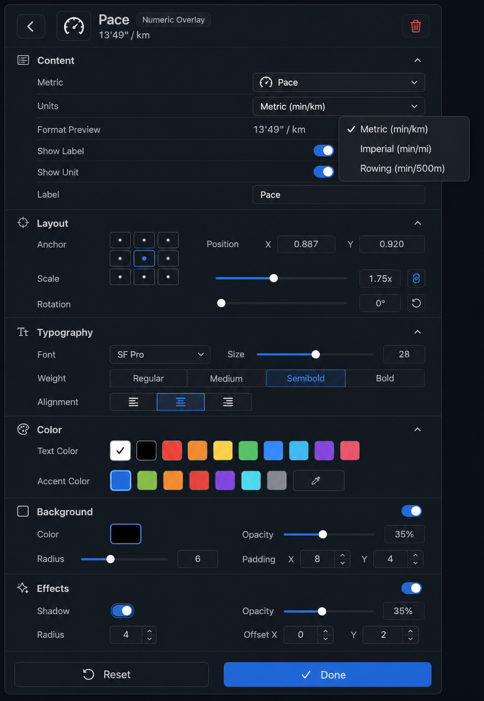

# Numeric Overlay UI Design Spec

Last updated: 2026-04-26

## Purpose

Numeric Overlay is the reusable Inspector detail template for overlays that display a single numeric or numeric-like metric value. It should replace one-off Pace-style detail layouts with a dense, consistent editing surface.

This spec guides all numeric overlay development, including UI, model mapping, formatting, unit selection, background styling, and implementation gaps.

## Design Reference

## Applies To

Use this template for these `OverlayElementType` values:

- `heartRate`
- `pace`
- `calories`
- `elapsedTime`
- `realTime`
- `distance`
- `elevation`
- `cadence`
- `power`

Do not use this template as-is for `distanceTimeline`, `elevationChart`, `runningGauge`, or `routeMap`. Those overlays may share lower-level controls, but they need chart/gauge/map-specific layouts.

## Design Direction

Numeric Overlay editing should feel closer to a DaVinci Resolve inspector than the earlier loose Pace panel:

- Dense parameter rows.
- Two-column label/control alignment.
- Compact section headers with icons and collapse affordances.
- Thin dividers instead of large card blocks.
- Minimal vertical gaps.
- Row heights around 30-34 px.
- Controls should be precise, model-backed, and fast to scan.

The panel should still use Running Overlay's dark design tokens and blue accent from [App UI](./app-ui.md).

## Header

Content:

- Back icon button.
- Metric/type icon.
- Title, e.g. `Pace`, `Heart Rate`, `Distance`.
- Pill: `Numeric Overlay`.
- Live value preview, e.g. `13'49" / km`.
- Trash icon button.

Rules:

- Header is compact and aligned with the shared Inspector detail header.
- The live value preview uses the same formatter as Preview and Added Elements.
- Trash remains the only destructive header action.

## Section Model

Sections:

1. `Content`
2. `Layout`
3. `Typography`
4. `Color`
5. `Background`
6. `Effects`

Each section should render as a compact collapsible group:

- Header height: 28-32 px.
- Small icon.
- Section title.
- Optional reset/action icon on the right only when model-backed.
- Body rows use a two-column grid: label left, control right.

Do not use large card containers for every row.

## Content Section

| Control | Example | Requirement |
| --- | --- | --- |
| `Metric` dropdown | `Pace` | Selects the metric/source when supported. |
| `Units` dropdown | `Metric (min/km)` | Required for metrics with unit variants. |
| `Format Preview` readout | `13'49" / km` | Always visible and model-backed through formatter. |
| `Show Label` toggle | On/off | Controls label visibility when supported. |
| `Show Unit` toggle | On/off | Controls unit suffix visibility when supported. |
| `Label` text field | `Pace` | Custom display label when supported. |

### Unit Selection

The Units control is a menu/dropdown. For Pace, include:

- `Metric (min/km)`
- `Imperial (min/mi)`
- `Rowing (min/500m)`

The selected option shows a checkmark.

Other numeric overlays should expose only relevant unit choices:

| Metric | Suggested units |
| --- | --- |
| Heart Rate | `bpm` |
| Pace | `Metric (min/km)`, `Imperial (min/mi)`, `Rowing (min/500m)` |
| Distance | `Metric (km)`, `Imperial (mi)`, `Meters (m)` |
| Elevation | `Metric (m)`, `Imperial (ft)` |
| Power | `watts` |
| Cadence | `spm` |
| Calories | `kcal` |
| Elapsed Time | `hh:mm:ss`, `mm:ss`, `seconds` |
| Real Time | `12-hour`, `24-hour` |

Implementation rule:

- If a metric has only one unit, the Units row can be read-only or omitted.
- Do not show a unit menu with fake choices that do not change formatting.

## Layout Section

Controls:

- Anchor: compact 3x3 grid.
- Position X and Y numeric fields on one row.
- Scale slider with value label.
- Rotation field/slider when supported.

Model mapping:

- Existing model supports `OverlayElement.position.x`, `OverlayElement.position.y`, and `OverlayElement.scale`.
- Rotation is a future field unless model support is added.

## Typography Section

Controls:

- Font dropdown.
- Font Size slider with numeric value.
- Weight segmented control: `Regular`, `Medium`, `Semibold`, `Bold`.
- Alignment icon segmented buttons: left, center, right.

Model mapping:

- Existing model supports `OverlayStyle.fontName`.
- Existing model supports `OverlayStyle.fontSize`.
- Existing model supports `OverlayStyle.fontWeight`.
- Alignment is a future field unless model support is added.

## Color Section

Controls:

- Text color swatches.
- Optional accent color swatches if the selected preset uses an accent.

Model mapping:

- Existing model supports `OverlayStyle.foregroundColor`.
- Accent color is a future field unless model support is added.

## Background Section

Controls:

- `Enable Background` toggle.
- Background color swatch.
- Opacity slider.
- Radius slider.
- Padding X and Padding Y fields or compact steppers.

Model mapping:

- Existing model supports `OverlayStyle.backgroundOpacity`.
- Existing model does not yet expose background enabled, background color, radius, or padding as separate persisted fields.

Implementation rule:

- In current model, `Enable Background` can map to `backgroundOpacity > 0` if product behavior is accepted.
- If background color/radius/padding are shown, they must be model-backed before appearing enabled.
- A disabled placeholder is acceptable only if visually clear.

## Effects Section

Controls:

- Shadow toggle.
- Shadow opacity slider.
- Shadow radius field/slider.

Model mapping:

- Existing model supports `OverlayStyle.shadowOpacity`.
- Existing model supports `OverlayStyle.shadowRadius`.
- Shadow toggle can map to `shadowOpacity > 0` if product behavior is accepted.

## Footer

Sticky footer:

- Secondary `Reset`.
- Primary `Done`.

Rules:

- Footer is compact.
- `Done` returns to Inspector outer/detail navigation as currently defined.
- `Reset` should only appear when reset behavior is implemented.

## Density And Layout Tokens

| Token | Value |
| --- | ---: |
| `numeric.sectionHeaderHeight` | 30 |
| `numeric.rowHeight` | 32 |
| `numeric.rowGap` | 6 |
| `numeric.sectionGap` | 8 |
| `numeric.labelColumnWidth` | 112 |
| `numeric.controlHeight` | 30 |
| `numeric.iconButtonSize` | 28 |
| `numeric.swatchSize` | 22 |

Inspector width:

- Default: 400 px.
- Minimum: 320 px.
- Numeric Overlay must remain usable at 380-400 px without text clipping.

## Model Gaps

The design intentionally includes controls that are desirable for a complete numeric overlay editor. These need model work before they can be enabled:

- Metric reassignment independent of `OverlayElementType`.
- Unit preference per overlay.
- Show label.
- Show unit.
- Custom label text.
- Rotation.
- Text alignment.
- Background enabled flag.
- Background color.
- Background radius.
- Background padding X/Y.
- Accent color.

Model-backed today:

- Type-derived metric.
- Formatted value preview.
- Position X/Y.
- Scale.
- Font name.
- Font size.
- Font weight.
- Foreground/text color.
- Background opacity.
- Shadow opacity.
- Shadow radius.

## Implementation Guidance

Recommended components:

- `NumericOverlayDetailView`
- `InspectorDenseSection`
- `InspectorDenseRow`
- `InspectorDenseMenuRow`
- `InspectorDenseToggleRow`
- `InspectorDenseSliderRow`
- `InspectorDenseNumberPairRow`
- `InspectorUnitMenu`
- `InspectorAnchorGrid`
- `InspectorSwatchRow`
- `InspectorSegmentedIconControl`

Suggested type helpers:

- `OverlayMetricKind`
- `OverlayUnitOption`
- `OverlayNumericFormat`
- `OverlayBackgroundStyle`
- `OverlayTextAlignment`

Do not duplicate one detail view per metric. Metric-specific behavior should be driven by configuration:

- available units
- default label
- formatter
- supported controls
- icon

## Acceptance Criteria

- Pace, Heart Rate, Distance, Power, Cadence, Calories, Elevation, Elapsed Time, and Real Time can all use the same dense detail template.
- Pace exposes `Metric (min/km)`, `Imperial (min/mi)`, and `Rowing (min/500m)`.
- Single-unit metrics do not show fake unit menus.
- Background toggle and background controls are present in the design, but implementation only enables model-backed controls.
- The panel is visibly denser than the earlier Pace implementation and avoids large cards or loose vertical gaps.
- The formatted preview updates when metric/unit/style choices change.

