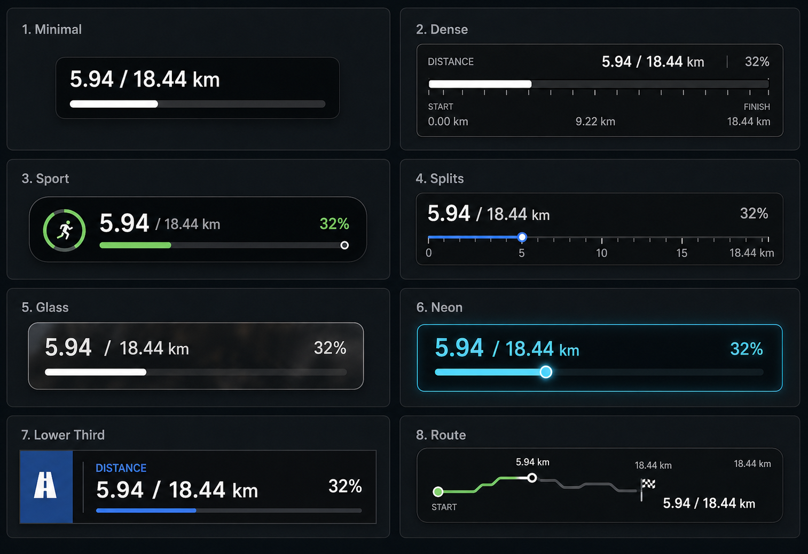

# Distance Timeline Overlay UI Design Spec

Last updated: 2026-04-28

## Purpose

Distance Timeline Overlay is a compact progress overlay that communicates current distance or activity progress on top of video. It is not the bottom editor timeline and it is not a single numeric text overlay. It is a visual component that combines value text, progress geometry, optional media/illustration slots, route or elevation context, borders, fade, and background styling.

This spec guides `OverlayElementType.distanceTimeline` design and implementation.

## Design Reference

The style board shows eight directions using the same sample value: `5.94 / 18.44 km`.

## Applies To

- `OverlayElementType.distanceTimeline`

Related but separate overlays:

- `elevationChart`: dedicated elevation chart overlay.
- `routeMap`: GPS map/route overlay.
- Numeric `distance`: single-value text overlay.

## Style Variants

The first implementation should support these presets as a stable enum. Implementations can ship a subset first, but the data model should avoid blocking the rest.

| Preset | Description | Best use |
| --- | --- | --- |
| `minimal` | Tight translucent dark widget, value text, slim progress bar. | Default, readable on most footage. |
| `dense` | DaVinci-like compact technical panel with ticks and segmented track. | Data-heavy videos and editor-style overlays. |
| `sport` | Sport-watch style, bold value, accent bar, optional media icon/animation on the left. | Fitness-forward content. |
| `splits` | Kilometer tick marks, current-position marker, optional start/finish labels. | Race recap and pacing videos. |
| `glass` | Translucent blurred dark panel with soft border and white fill. | Scenic footage where overlay should feel embedded. |
| `neon` | Cyan/glow progress line and pulse marker. | Night/tech/futuristic edits. |
| `lowerThird` | Broadcast lower-third with left media slot, label, value, percent, line under text. | More editorial videos. |
| `route` | Route/path-like progress line with start/finish dots and optional elevation underlay. | Route recap or terrain storytelling. |

## Core Content

Every preset must support:

- Current distance.
- Total distance.
- Progress fraction.
- Formatted value text, e.g. `5.94 / 18.44 km`.

Optional content:

- Label, e.g. `Distance`.
- Percent, e.g. `32%`.
- Start/finish labels.
- Tick labels.
- Current-position marker.
- Left media slot.
- Elevation/route underlay.

## Custom Media Slot

`sport` and `lowerThird` should support a customizable left media slot.

Supported slot modes:

- `none`
- `systemIcon`
- `staticSVG`
- `animatedSVG`
- `image`
- `videoLoop` (future)

Use cases:

- Runner icon.
- Shoe icon.
- Race logo.
- Animated SVG pulse/runner.
- Sponsor or event mark.

Rules:

- The slot must be optional.
- Slot size should be fixed per preset so text alignment does not jump.
- Animated SVG must be previewable in app and exportable deterministically.
- If animated SVG export is not implemented, allow static SVG first and render animated assets as disabled/future in Inspector.
- Slot media should be project-local or embedded in the project package when project packaging exists.

Recommended controls:

- `Media Slot` toggle.
- `Source Type` menu.
- `Asset` picker/import.
- `Size` slider.
- `Tint` mode: original / text color / accent color.
- `Animation Speed` for animated SVG only.
- `Loop` toggle for animated assets.

## Route And Elevation Customization

The `route` preset can display a route-like progress line and/or a compact elevation profile under the line.

Route options:

- Path mode: straight / stepped / curved / sampled route.
- Start dot.
- Finish dot.
- Current marker.
- Marker size.
- Line width.
- Line cap: round / square.
- Progress color mode: solid / gradient.

Elevation options:

- Show elevation profile.
- Profile source: FIT elevation samples.
- Profile line color.
- Profile fill/shadow under the line.
- Fill opacity.
- Shadow blur.
- Shadow offset.
- Clip profile to progress or show full route profile.

Elevation under-line shadow:

- Enabled by default for `route` only when elevation profile is visible.
- Keep it subtle so it reads as depth/terrain, not a heavy chart area.
- Suggested default: fill opacity `0.18`, shadow opacity `0.25`, blur `6`.

## Border, Edge, And Fade

All presets should support edge treatment, with sensible defaults per preset.

Controls:

- `Border` toggle.
- Border color.
- Border opacity.
- Border width.
- Corner radius.
- `Fade Out` toggle.
- Fade edge: left / right / both / vertical / all.
- Fade amount.

Fade Out behavior:

- Fades the overlay container or selected visual layer into the underlying video.
- Useful for `glass`, `route`, and lower-third designs.
- Should not make text unreadable. Text fade should be separate from background/track fade where possible.

Suggested fade implementation:

- Apply alpha mask to background/track layer.
- Keep primary value text at full opacity by default.
- Allow `Fade Text` only as an advanced option.

## Background

Controls:

- Background enabled.
- Background color.
- Background opacity.
- Blur/material style, if supported.
- Corner radius.
- Padding X/Y.

Preset defaults:

- `minimal`: enabled, black 70%.
- `dense`: enabled, panel background 80%.
- `sport`: enabled, black 76%.
- `splits`: enabled, black 65%.
- `glass`: enabled, blur/material with subtle border.
- `neon`: enabled, black 60%, glow on progress.
- `lowerThird`: optional, flatter and wider.
- `route`: optional, depends on line/profile contrast.

## Progress Track

Controls:

- Track style: solid / segmented / ticks / line / route path / elevation.
- Track height.
- Track color.
- Track opacity.
- Fill color.
- Fill opacity.
- Fill gradient.
- Current marker toggle.
- Current marker shape: dot / pill / triangle / pulse.
- Tick marks toggle.
- Tick interval: auto / 1 km / 5 km / lap.

## Typography

Controls:

- Font family.
- Value font size.
- Label font size.
- Unit font size.
- Font weight.
- Text color.
- Text alignment.
- Value layout: inline / stacked / split left-right.

## Inspector Sections

Use dense Inspector primitives from Numeric Overlay:

1. `Preset`
2. `Content`
3. `Layout`
4. `Progress`
5. `Media Slot`
6. `Route / Elevation`
7. `Background & Border`
8. `Typography`
9. `Effects`

Section rules:

- Keep rows around 30-34 px high.
- Hide irrelevant sections for presets where they do not apply.
- Do not show animated SVG controls unless media slot mode is animated.
- Do not show elevation controls unless `route` or an elevation-capable preset is selected.

## Current Model Gaps

Current `distanceTimelineLayout` is mostly hard-coded:

- Width and height are fixed from scale.
- One progress bar style.
- One label format.
- No preset enum.
- No media slot.
- No elevation profile.
- No route path mode.
- No border toggle.
- No fade options.
- No background color/radius/padding fields specific to distance timeline.

Required model additions:

- `DistanceTimelinePreset`
- `DistanceTimelineStyle`
- `DistanceTimelineMediaSlot`
- `DistanceTimelineTrackStyle`
- `DistanceTimelineRouteStyle`
- `DistanceTimelineElevationStyle`
- `OverlayEdgeFadeStyle`
- Background/border/fade fields for this overlay.

## Implementation Phasing

Phase 1:

- Add preset enum and style config.
- Implement `minimal`, `dense`, `sport`, and `lowerThird`.
- Add border toggle and background controls.
- Add static media slot for `sport` and `lowerThird`.

Phase 2:

- Add `splits`, `glass`, and `neon`.
- Add tick marks, current marker, segmented track, glow.
- Add fade out masks.

Phase 3:

- Add `route` preset.
- Add elevation profile underlay.
- Add elevation fill/shadow controls.
- Add sampled route/progress path if GPS is available.

Phase 4:

- Add animated SVG slot rendering.
- Verify animation timing in preview and export.
- Add asset packaging/persistence strategy.

## Acceptance Criteria

- The overlay can reproduce the existing compact dark progress bar as `minimal`.
- `sport` and `lowerThird` expose a customizable left media slot.
- `route` exposes route/elevation customization.
- Elevation profile can render a line plus optional shaded/blurred underlay.
- Border can be toggled independently from background.
- Fade Out can be enabled without fading primary text by default.
- Unsupported controls are hidden or disabled clearly until model/export support exists.

