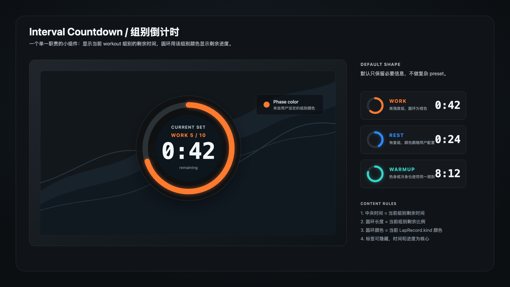

# Interval Countdown Overlay UI Concept

Last updated: 2026-07-08

## Purpose

Interval Countdown is a compact circular overlay for structured workouts. It
answers one question: how much time remains in the current workout segment.

Design reference:

Structured implementation guide:

- [Interval Countdown structured spec](./interval-countdown-overlay-ui.spec.json)

## Default Direction

- Circular translucent dark background.
- One circular progress track.
- Progress color follows the user's configured interval color for the current
  lap kind: warmup, active/work, rest, cooldown, or unknown.
- Center text shows current-segment remaining time.
- A small phase / rep label may appear above the time, but the time and progress
  ring remain the primary information.
- Use monospaced or tabular digits so countdown changes do not shift the layout.

## Content And Visibility

The center value is the only required text. It can show the current segment's
time or distance, in either `End to 0` or `0 to End` direction. Every other
text role can be hidden independently:

- Phase label, such as `WORK`, `REST`, `WU`, or `CD`.
- Rep label, such as `5 / 10`.
- Helper label, such as `CURRENT SET`.
- Caption, such as `remaining`.

Hidden text must not leave empty rows that make the circle feel off-center. The
remaining visible content should recenter inside the inner circle while keeping
the countdown time visually dominant.

## Typography And Text Color

Every text role is independently adjustable:

- Font family.
- Font size.
- Font weight.
- Text color mode.
- Custom text color when the role is not following the group color.

Text color mode supports:

- `Follow Group Color`: resolve from the current interval group color.
- `Custom Color`: use one fixed user-selected color for that role.

The countdown time also supports these typography and color controls, but it is
not hideable. Use tabular or monospaced digits by default to prevent layout
jitter during countdown updates.

In the Text inspector, group controls by role: Helper, Phase, Rep, Countdown,
and Caption. A hideable role puts its Visible mini switch in the trailing group
header; the rows beneath use only Font, Size, Weight, Color, and Custom labels.

## Progress Ring

The progress ring represents the current segment remaining fraction. It is not a
whole-workout progress indicator.

Rules:

- Track color is a neutral dark color.
- Fill color follows the current interval group color by default.
- Fill color may use a custom single color if the user disables following the
  group color.
- Direction offers two paired countdown treatments: clockwise `Full to Empty`
  is the default; counterclockwise `Empty to Full` fills the elapsed portion.
- Ring width is adjustable.
- Ring-local glow is controlled separately from shared overlay glow. It applies
  only to the progress fill, not the track, background, or text.

Progress animation should move smoothly at Layer Data FPS and must match preview
and export.

## Background, Shadow, And Glow

Interval Countdown uses the shared `OverlayBackgroundInspectorModule`,
`OverlayBorderInspectorModule`, and `OverlayEffectsInspectorModule`.

Background behavior:

- When Background is enabled, the background surface owns the fill, radius,
  padding, border, and shadow target.
- When Background is disabled, no synthetic circular card is drawn behind the
  ring. The ring and text render as foreground parts over the video.
- Background padding expands the background and border bounds only. It must not
  scale, move, or compress the countdown time, labels, or progress ring.

Shadow behavior:

- When Background is enabled and Shadow is enabled, shadow applies only to the
  background surface.
- When Background is disabled and Shadow is enabled, shadow applies to every
  visible internal part: progress track, progress fill, countdown time, and any
  visible labels or captions.

Glow behavior:

- Progress Ring Glow is a component-local effect on the progress fill only.
- Shared/global Glow from Effects applies to the full foreground content group
  when Background is disabled.
- If Background is disabled and shared/global Glow is enabled, all visible
  internal parts glow together, including text, progress track, and progress
  fill. Progress Ring Glow may still add an additional ring-only glow.
- If Background is enabled and shared/global Glow is enabled, the glow follows
  the foreground content group inside the background; it does not replace the
  component-local Progress Ring Glow.

## Initial Controls

Keep the first version intentionally small:

- Size.
- Center value metric (`Time` / `Distance`).
- Center value direction (`End to 0` / `0 to End`).
- Ring width.
- Progress ring color mode.
- Progress ring custom color.
- Progress ring direction (`Clockwise` / `Counterclockwise`).
- Progress ring glow toggle and intensity.
- Show / hide phase label.
- Show / hide rep label.
- Show / hide helper label.
- Show / hide `remaining` caption.
- Typography controls for every text role.
- Text color mode and custom color for every text role.
- Background opacity.
- Per-kind colors should reuse existing interval color settings instead of
  introducing a separate preset system.

Recommended Inspector sections:

1. `Layout`
2. `Center Value`
3. `Progress Ring`
4. `Text`
5. `Background`
6. `Border`
7. `Effects`

## Non-Goals For First Pass

- No multi-metric cells.
- No full workout timeline.
- No complex preset board.
- No separate color palette unless existing interval colors are unavailable.
