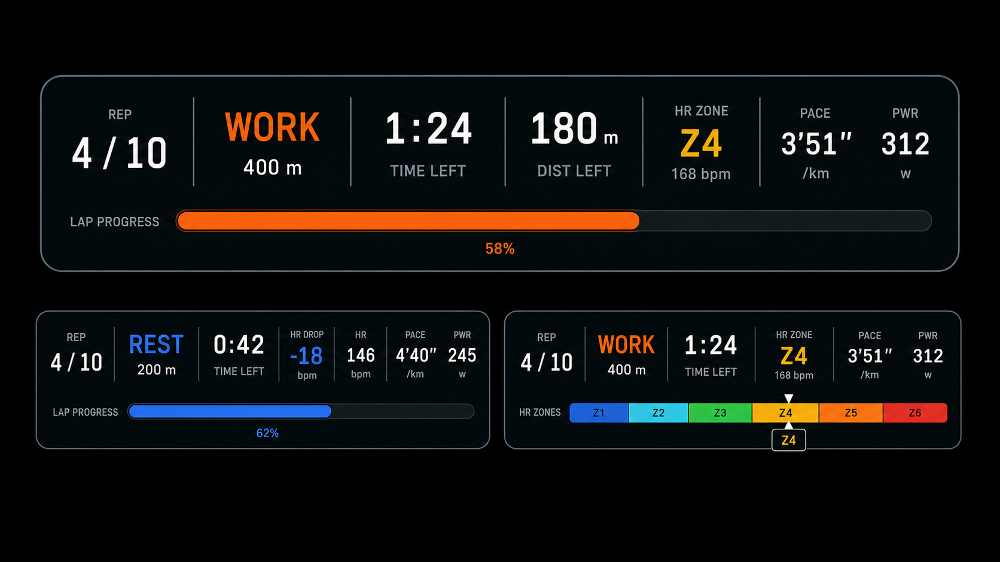
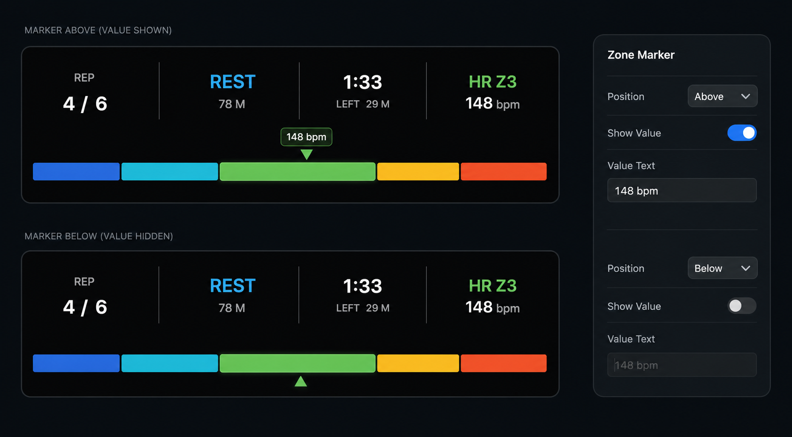

# Interval HUD Bar Overlay UI Design Spec

Last updated: 2026-05-13

## Purpose

Interval HUD Bar is a wide, horizontal overlay for interval-training videos. It shows current rep, phase, remaining time or distance, live metrics, and an optional bottom progress or intensity bar.

Design reference:

## Applies To

- `OverlayElementType.intervalHUDBar`

Replaces retired lap overlay prototypes:

- `Lap Live`: compact vertical lap HUD.
- `Lap Card`: recovery recap card.
- `Lap List`: full lap list teleprompter.

## Functional Scope

The first implementation supports:

- Rep count.
- Current phase.
- Current phase distance.
- Time left.
- Distance left.
- HR zone or REST HR drop in a dedicated HUD cell.
- Current HR.
- Current pace.
- Current power.
- REST HR drop.
- Optional bottom bar: lap progress, HR zones, pace zones, or none.

Do not include Target Pace in v1.

## Layout

The default layout is a single rounded horizontal HUD:

- Dark translucent panel with a subtle border.
- Main row split into compact vertical blocks.
- Thin separators between blocks.
- Bottom bar embedded inside the same container.
- No nested cards.

Default block order:

1. `REP`
2. Phase (`WORK`, `REST`, `WU`, `CD`, `LAP`) plus lap distance.
3. Remaining block, with user-selectable primary value:
   - `TIME LEFT` primary with distance as secondary.
   - `DIST LEFT` primary with time as secondary.
4. Optional `HR ZONE` cell.
5. Ordered metric slots (Numeric Overlay metrics only, repeated as configured).

Metric slots are an append/delete ordered list. Each metric block is separated by the same divider treatment as the fixed `REP`, phase, and remaining blocks. Duplicate metric slots are allowed so users can build dense or repeated layouts for different output contexts.

The main row uses equal-width cells. Enabled `REP`, current training, remaining, HR Zone, and every configured metric each occupy one cell. If there are no metrics, the HUD does not reserve an empty metrics area.

The first four cells are controlled by HUD Bar settings:

- `Rep`: show/hide the rep count.
- `Current Training`: show/hide the current interval item. Its detail can show remaining time or remaining distance; REST has an independent detail setting.
- `Remaining`: show/hide the remaining block. Its primary value can be time left or distance left.
- `HR Zone`: show/hide the zone cell. Mode `HR Zone` always shows the current zone; mode `HR Drop at Rest` shows HR Zone during training and switches to HR Drop only during REST.
  - HR Drop display mode (`bpm` / `%`) lives directly under the HR Zone settings because it only affects the HR Zone cell's REST state.

`HR DROP` no longer appears in the Metrics add list.

## Visual Style

- Use the app's dark professional video-editor visual language.
- Keep typography compact, uppercase, and legible over video.
- Use monospaced digits for changing numeric values.
- Internal separators should be thin and low contrast.
- Corner radius should stay restrained.
- The bottom bar should not add a second container; it lives inside the HUD.

Phase colors:

| Phase | Color |
| --- | --- |
| `WORK` | Orange |
| `REST` | Blue |
| `WU` | Teal |
| `CD` | Purple |
| `LAP` | FIT green / neutral |

## Bottom Bar

Bottom Bar is a separate Inspector section below Metrics. It has its own enable switch.

Type menu:

- `Lap Progress`
- `HR Zones`
- `Pace Zones`

Shared Bottom Bar controls:

- Spacing controls the vertical gap between the data cells and bottom bar.
- Corner Radius controls the whole bottom bar shape; `0` supports square progress bars.
- Border can be enabled independently of the main HUD container border. It exposes color, opacity, and width, and applies to all bottom bar modes.

`Lap Progress` mode:

- Track is a dark neutral strip.
- Fill is current phase color.
- Label may read `LAP PROGRESS`.
- Optional percentage may sit below or inside the fill, as long as it does not collide with the bar.
- Progress can be based on time or distance.
- Glow highlights the completed portion. Glow intensity is editable; color follows the current phase.

`heartRateZones` mode:

- Bar becomes a segmented Z1-Z6 strip.
- Segment colors use the shared HR zone palette from Project Settings.
- Current active segment uses full opacity; inactive segment opacity is user-adjustable and must remain readable on the black HUD background.
- Active Zone Width can keep equal segments or expand the active segment up to 50% of the full bar. Remaining segments divide the leftover width evenly.
- Active Zone Height can raise the active segment up to 2x the base bar height, centered on the bottom bar axis, so the active zone reads as emphasized without moving the HUD layout.
- Zone Gap controls the visual divider space between adjacent zone segments.
- Corner Radius follows the shared Bottom Bar radius.
- Optional Zone Marker is one solid filled triangle that points at the user's current HR position within the active segment.
- Marker Position can be `Above` or `Below`; Marker Value can be shown or hidden. The marker and value use the active zone color.
- Current zone label, such as `Z4`, uses the same zone color.
- Glow highlights the active segment. Glow intensity is editable; color follows the active zone.

`paceZones` mode:

- Same visual pattern as HR zone mode, driven by pace ranges.
- Current pace uses the matched zone segment.
- Active Zone Width and Zone Marker behave the same as HR Zones, but marker position is derived from current pace within the matched pace range.
- Glow follows the matched active segment.

## REST HR Drop

REST mode should support HR drop display:

- `bpm` display: `HR DROP -18 bpm`.
- percentage display: `HR DROP 10%`.

The display mode should be a style option, not inferred from the selected bottom bar.

## Typography Roles

Interval HUD Bar exposes separate font controls for every data text role so users can tune the bar for broadcast overlays, mobile crops, or dense desktop videos.

Editable typography roles:

- `Labels`: small uppercase labels such as `REP`, `LEFT`, `HR`, and `PACE`.
- `Primary Values`: large values in the rep and remaining blocks.
- `Phase`: current interval item, such as `WORK` or `REST`.
- `Phase Detail`: lap distance under the phase label.
- `Metric Values`: live metric values such as `153`, `3'51"`, or `247`.
- `Metric Units`: metric suffixes such as `bpm`, `/km`, or `w`.

Each role exposes font family, size, and weight. Digits should remain legible during rapid value changes; monospaced or tabular fonts are preferred when available.

## Inspector Guidance

Implemented Inspector sections:

- Layout: placement, size, and transform controls through the shared layout module.
- HUD Bar: width, height, Rep toggle, Current Training toggle and detail modes, Remaining toggle and primary mode, HR Zone toggle, Zone mode, and HR Drop mode.
- Metrics: ordered add/delete list. Each row chooses one Numeric Overlay metric; the list has no fixed slot count and duplicates are valid. Metrics that support multiple units expose a per-row Units menu, reusing Numeric Overlay unit options such as pace `min/km` / `min/mi`, distance `km` / `mi` / `m`, elevation `m` / `ft`, and temperature `°C` / `°F`.
- Bottom Bar: section-header enable switch, type menu (`Lap Progress`, `HR Zones`, `Pace Zones`), Spacing slider, Corner Radius slider, Border toggle, Border Color, Border Width, Border Opacity, Lap Progress mode shows progress mode (`Time` / `Distance`), Glow toggle, and Glow Intensity.
- Bottom Bar zone settings: Active Zone Width slider (`Equal` to `50%`), Active Zone Height slider, Zone Gap slider, Inactive Opacity slider, Zone Marker toggle, Marker Position (`Above` / `Below`), and Marker Value toggle. These controls appear only for `HR Zones` and `Pace Zones`.
- Typography: font family, size, and weight for Labels, Primary Values, Phase, Phase Detail, Metric Values, and Metric Units.
- Divider: shared overlay divider fields used for all internal vertical separators.
- Background: shared `OverlayBackgroundInspectorModule`.
- Border: shared `OverlayBorderInspectorModule`.
- Effects: shared `OverlayEffectsInspectorModule`; Shadow renders on the outer HUD container in both preview and export.

The last four sections must stay in this order: `Divider`, `Background`, `Border`, `Effects`. `Background`, `Border`, and `Effects` reuse the shared Inspector components. `Divider` uses the shared overlay divider model fields so the renderer, preview, and export stay aligned.

Background Padding is interpreted as HUD interior padding for this fixed-size overlay. X padding moves all HUD cells and the bottom bar inward; Y padding increases top and bottom interior space.

Bottom Bar Spacing is the vertical gap between the data cell row and the bottom bar. `0` places the bottom bar directly against the data row layout area; increasing the value moves the data row and bottom bar farther apart. The renderer preserves the requested spacing first, then compresses top/bottom padding when the HUD is short. If the HUD still cannot fit the data row and bar, the rendered gap is capped so content remains inside the background container.

Zone Marker is a floating overlay anchored to the current value position on the zone bar. It does not reserve layout height, move the bottom bar, change spacing, or resize the data row. Above and Below placements may overlap HUD text or extend beyond the background container.

Bottom Bar Border is separate from the shared overlay Border section. The shared Border controls the outer HUD container; Bottom Bar Border controls only the progress/zone strip and must render in both preview and export.

Effects Shadow uses the shared `shadowColor`, opacity, radius, offset, and thickness fields. When Background is enabled, shadow follows the HUD container shape. When both Background and Border are disabled, shadow applies to the full HUD content group, including text, dividers, the bottom bar, and floating zone marker.

Do not expose Target Pace controls until target workout data exists.

## Implementation Notes

- Derive interval state from `ActivityTimeline.laps` and `LapRecord.kind`.
- Rep count uses `.active` laps only.
- REST uses the most recent active rep number.
- HR zone and pace zone color resolution should use one shared palette/helper also used by `HeartRateZonesView`.
- Preview and export share one render layout so values and geometry match.
