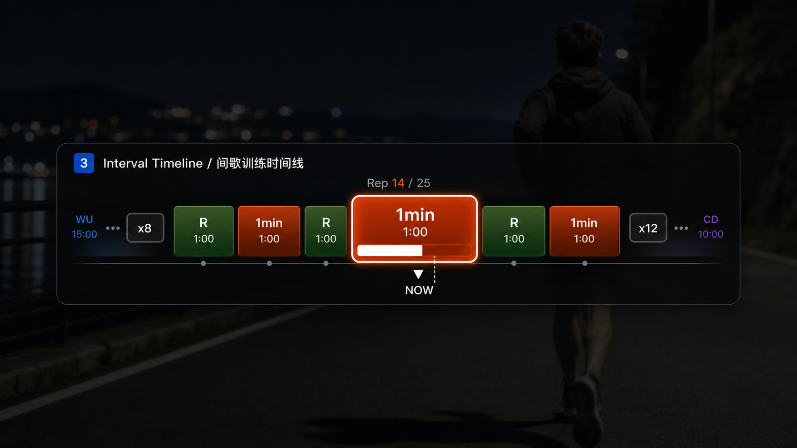

# Interval Timeline Overlay UI Design Spec

Last updated: 2026-06-15

## Goal

Interval Timeline is a horizontal workout-schedule overlay for interval sessions. It complements `Interval HUD Bar`: the HUD answers "what am I doing now?", while Interval Timeline answers "where am I inside the whole workout?".

The component should make short structured workouts and high-repetition workouts readable on video:

- Show warmup, active intervals, recoveries, cooldown, and unknown laps as a compact horizontal sequence.
- Keep the current interval visually dominant and centered by default.
- Handle large sets such as `1min x25` without forcing 25 identical blocks into unreadable slivers.
- Preserve enough neighboring context that viewers understand what just happened and what is next.

## Default Visual Direction

Use a broadcast-sport HUD strip, visually close to the provided reference but aligned with the app's dark overlay language.



The mockup's top title row (`3 Interval Timeline / 间歇训练时间线`) is a design-board label only. The real overlay element should render as the timeline rail itself: no title badge, no overlay name, no legend, and no mode switch controls.

```
 WU        | 400m     R      400m     R      400m |      CD
 15:00     | 1:30    1:00    1:30    1:00    1:30 |    10:00
 ━━━━━━━━━━━╾━━━━━━━╾━━━━━━╾━━━━━━━━╾━━━━━━╾━━━━━━╾━━━━━━━━
                         ▲ NOW
```

Baseline layout:

- Background: translucent near-black rounded strip with optional blur/fade edges.
- Track: one horizontal bar composed of lap segments.
- Segment labels: current segment can show live/remaining lap distance and live/remaining lap time as independent rows; non-current segments can show distance, time, or no text.
- Current segment: taller, brighter, slightly wider, with border/glow and a progress fill inside the segment.
- Playhead: small upward marker below the rail and `NOW` label under the marker. A marker lane is always reserved in the overlay bounds so the marker stays inside the background and border. Toggling marker visibility must not move the segment row, rail, or marker lane.
- Decoration rail: optional line-and-dot progress decoration below the segment row and inside the background. `Spacing` controls the vertical distance from the segment row to the rail and expands the background height; dots expose size, color, and alpha, while the rail line exposes width and color.
- Edge treatment: left/right fade masks plus optional `···` overflow hints when many laps are omitted. The runtime no longer renders WU/CD ghost endpoint labels or `xN` hidden-count boxes, because hidden counts are segment counts rather than repeated-set counts.

## Segment Semantics

Use existing `ActivityTimeline.laps` and `LapRecord.kind`:

| LapKind | Default color | Notes |
|---|---|---|
| `warmup` | blue | Start preparation block |
| `active` | orange/red | Work interval |
| `rest` | green | Recovery jog/walk |
| `cooldown` | purple | End block |
| `unknown` | slate | Fallback |

Labels no longer use a `kind` / `distance` mode. The Labels inspector controls visible text directly:

- `Current Dist`: `Off`, `Live`, or `Remain`.
- `Current Time`: `Off`, `Live`, or `Remain`.
- `Neighbor`: `Off`, `Distance`, or `Time` for non-current segments.

Time labels use lap elapsed or remaining time formatted as `m:ss` or `h:mm:ss`. Distance labels use lap distance values formatted in meters or kilometers. Current distance uses distance progress when available.

## Layout Modes

### 1. Centered Window (Default)

The current lap is pinned to the component's visual center. The timeline shifts underneath it as playback advances.

Rules:

- Show the current lap at full emphasis.
- Show a configurable number of neighboring laps on both sides, default `3 + current + 3`.
- Keep warmup/cooldown visible only when they fit inside the selected window or are adjacent to the visible set.
- Add a compact left/right `···` hint when hidden laps exist.
- Fade clipped edges so the timeline reads as continuous, not abruptly cut.

This is the recommended mode for `1min x25`: viewers see current work/rest plus nearby repetitions, while the current lap remains stable.

### 2. Full Schedule

Render the whole workout across the available width.

Rules:

- Segment widths use the selected Full layout: `Equal` distributes enabled segments evenly by default, with Current Width able to enlarge the current segment from an `Equal` minimum; `Duration` uses lap-duration proportions with min-width clamps.
- When labels do not fit, keep color blocks and rely on the user's Labels settings to reduce text density.
- Useful for low-count workouts such as `WU + 6 x 400m/R + CD`.
- Full Schedule is explicit and never automatically falls back to Centered Window. High-count workouts may become dense in Full mode; users can return to Centered mode for nearby-context rendering.

### 3. Compressed Sets

Group repeated active/rest pairs into a set block when the full sequence is too dense.

Example: `1:00 RUN + 1:00 R` repeated 25 times becomes:

```
WU | RUN/R x25  [ current pair expanded in center ] | CD
```

Rules:

- Detect repeated adjacent pairs with same `kind` pattern and similar duration/distance.
- Render far-away repetitions as a compressed set rail with small ticks.
- Expand the current pair and one pair on each side into readable blocks.
- Show set counter text near the current block, e.g. `Rep 14 / 25`.

Compressed Sets can be a later enhancement; Centered Window is the first implementation path.

## Current Segment Emphasis

The current segment must be obvious at video scale:

- Height: 1.25-1.45x normal segment height.
- Width: at least 1.15x neighboring min width in Centered Window mode.
- In Full Schedule + Equal, the Current Width control starts at `Equal` and can increase the current segment's target share of total segment width.
- Typography: primary label 15-20% larger and semibold/bold.
- Progress fill: inside-current-block fill from start to current elapsed fraction, using white or a lighter version of the segment color.
- Border: 1-2 px light stroke plus optional soft glow.
- The `NOW` marker aligns to the current segment's live progress point by default, with an option to align to segment center for a stable reference-marker style.

## Large Repetition Behavior

For high-count workouts:

- Do not render all labels at once when segment width would fall below the readable minimum.
- Default mode remains Centered Window so high-repetition workouts open in a readable nearby-context layout.
- Hidden previous/next laps are represented by low-contrast `···` hints and edge fades.
- The active repetition counter should be available as optional text, e.g. `Rep 9 / 25`. It is shown only while the current lap is `active`; warmup, rest, cooldown, and unknown laps do not display a rep counter.
- WU, Rest, and CD can each be hidden from the timeline. Filtering happens before Centered neighbor selection or Full layout. If the current lap is hidden, no segment receives current emphasis and the marker falls back to the nearest visible segment.

## Inspector Surface

Recommended sections:

- **Layout**: shared Position, Scale, Width, Height, Opacity.
- **Timeline**: Mode (`Centered`, `Full`, `Compressed Sets`), Full layout (`Equal` / `Duration`), visible neighbors, WU/Rest/CD visibility toggles, min segment width, segment gap.
- **Current**: emphasis scale, current progress toggle, playhead marker toggle, marker label (`NOW`), marker position (`live progress` / `segment center`), marker color, marker size, marker weight.
- **Rail**: rail toggle, vertical spacing from segment row, dot size, dot alpha, dot color, line width, line color.
- **Labels**: current distance (`Off` / `Live` / `Remain`), current time (`Off` / `Live` / `Remain`), neighbor metric (`Off` / `Distance` / `Time`), rep counter, overflow hint, typography.
- **Colors**: per-kind colors for warmup, active, rest, cooldown, unknown; completed opacity; future opacity.
- **Background**: reuse shared background controls.
- **Border & Effects**: reuse shared border/effects controls.

## First-Version Defaults

| Field | Default |
|---|---|
| Width | 780 pt |
| Height | 64 pt |
| Mode | Centered Window |
| Visible neighbors | 3 each side |
| Full layout | Equal |
| Show WU / Rest / CD | on |
| Overflow hint | on |
| Current distance label | Live |
| Current time label | Remain |
| Neighbor label | Distance |
| Segment height | 30 pt |
| Current segment height scale | 1.35 |
| Full Equal current width | Equal |
| Min segment width | 54 pt |
| Segment gap | 4 pt |
| Background opacity | 0.78 |
| Corner radius | 8 pt |
| Edge fade | on |
| Current progress | on |
| Marker | on, label `NOW`, white 11 pt bold |
| Rail | on, 5 pt below segments, 5 pt dot size, white dots at 0.36 alpha, slate 5 pt line |

## Implementation Notes

- Implemented as dedicated `OverlayElementType.intervalTimeline`; do not overload `distanceTimeline`.
- Store style in `OverlayStyle.intervalTimeline`.
- Layout is computed in `OverlayRenderModel.intervalTimelineLayout(for:in:)` and shared by SwiftUI Preview and CoreGraphics export.
- The first implementation ships Centered Window and Full Schedule. Compressed Sets can be feature-gated or added after the base renderer is stable.
- Full Schedule uses explicit user intent: `Equal` and `Duration` only change segment width distribution and do not change which segments are visible. Full + Equal keeps equal widths at the Current Width minimum and lets the slider enlarge the current segment.
- Preview and export must agree on which laps are visible for a given `elapsedTime`; avoid UI-only scroll state in the render path.

## Acceptance Criteria

- `WU + 6 x 400m/R + CD` shows the complete sequence in Full Schedule and a centered current segment in Centered Window.
- `1min x25` defaults to a readable centered window, with current segment centered and hidden repetitions summarized at the edges.
- Full Schedule shows all enabled segments regardless of lap count, with Equal and Duration layout options.
- WU, Rest, and CD visibility toggles filter those segment kinds consistently in preview and export.
- Current active/rest lap changes do not cause the overlay bounds to jump.
- Toggling the marker does not change segment geometry, marker lane, or the rail position.
- The marker triangle and label remain inside the background and border at all supported rail sizes and marker font sizes.
- Overflow hints remain compact and reserve enough width to avoid overlapping the first or last visible segment.
- Increasing rail spacing keeps the rail inside the background by increasing the rendered background height.
- The Inspector keeps `Reset` and `Done` fixed at the bottom while sections scroll.
- Current lap progress advances smoothly at Layer Data FPS.
- Labels never overlap inside segment blocks; when space is insufficient, labels reduce to kind-only or hide duration before shrinking below readable size.
- Preview and exported PNG/MOV frames match visually.
