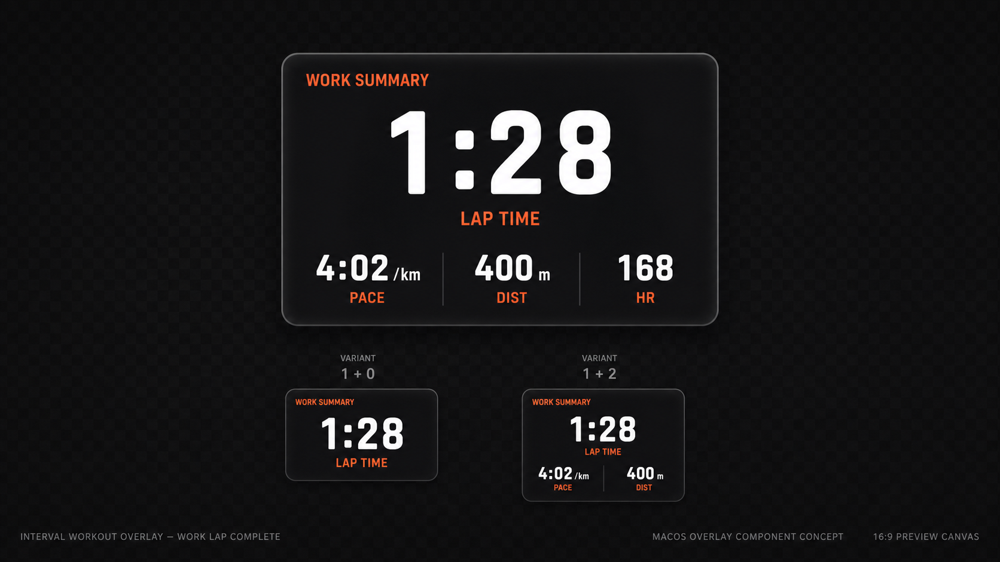

# Interval Work Summary Overlay UI

The Interval Work Summary overlay is a compact, high-signal interval-series
component that appears when a work lap completes. It summarizes the completed
work segment with one required primary metric and up to three optional secondary
metrics.

## Purpose

- Show the just-finished work lap at the moment the athlete transitions out of
  the effort.
- Prioritize immediate readability over decoration.
- Keep the shape close to the Interval Countdown component: dark translucent
  background, sparse group-color accents, strong typographic hierarchy, and
  shared Background / Border / Effects behavior.

## Layout

- The component uses a single rounded rectangle container.
- A small optional component label sits at the top. Users can align it left,
  center, or right. It must not use a trailing rule or decorative line.
- The primary metric is required and centered. Default: `Lap Time`.
- Secondary metrics are optional. Users can show zero, one, two, or three
  secondary cells. Default: `Lap Pace`, `Lap Distance`, `Avg Heart Rate`.
- Secondary cells use equal-width columns and may show subtle vertical dividers
  only between visible cells.

## Timing

- The overlay is event-like, not persistent.
- It appears only after a completed `work` / active lap.
- Default display window: 6 seconds after the active lap end time.
- Outside the display window, the overlay should render no visible content in
  preview and export.

## Typography And Color

- All text roles are individually configurable for font family, size, weight,
  color mode, and custom color.
- Text roles:
  - component label
  - primary value
  - primary label
  - secondary value
  - secondary label
- Component label and metric labels can be hidden.
- Component label alignment is configurable: left, center, or right.
- Primary value is always visible.
- Color modes:
  - follow group color
  - custom single color
- The default group color follows the completed work lap color.

## Shared Effects

- Background, Border, and Effects controls must reuse the shared dense inspector
  sections.
- If background is enabled and shadow is enabled, only the background casts the
  shared shadow.
- If background is disabled and shadow is enabled, visible content casts the
  shared shadow.
- Shared glow follows the existing global overlay glow behavior. This component
  has no separate local glow in the initial version.

## Inspector Guidance

- Use the same dense row system as Background, Border, Effects, Interval
  Timeline, and Interval Countdown.
- Avoid standalone native controls that create inconsistent spacing.
- Use mini switches on the right for visibility toggles.
- Use dense slider rows with right-side numeric readouts.
- Use segmented controls for color mode and metric selection where space allows;
  use dense menus for longer metric lists.
