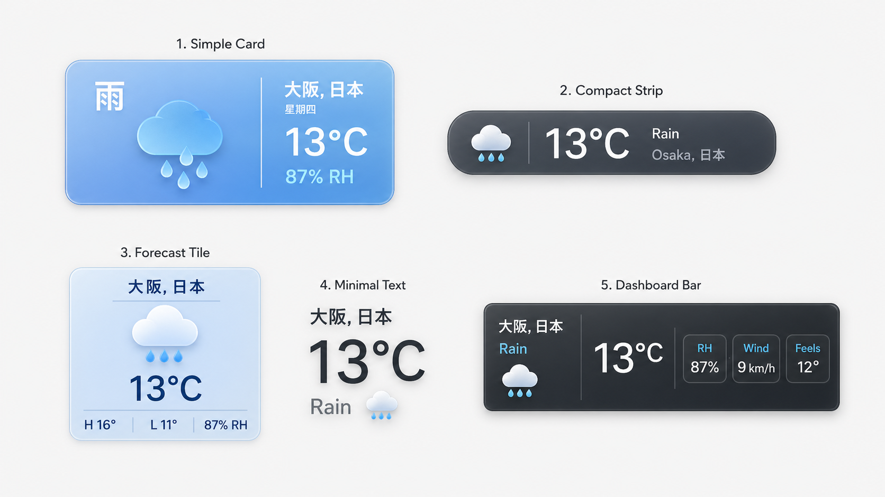
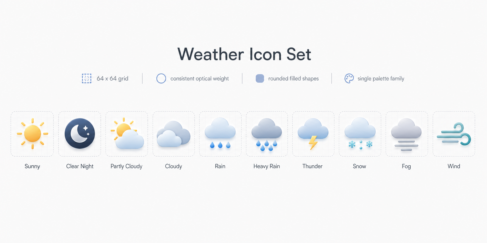

# Weather Widget Overlay UI Design Spec

Last updated: 2026-05-07

## Purpose

Weather Widget Overlay is a simple weather-app-style overlay for showing the day-of-run weather context on exported running videos. It should feel like a compact weather app plugin rather than a sport-specific performance module.

The visual implementation and first API fetch pass are in place. The component renders with local preset styling plus a shared SwiftUI weather icon family, and it can cache Open-Meteo historical weather from either activity GPS or current device location.

When a Weather Widget is first added, it starts from activity-location
Open-Meteo data rather than baked-in sample content. If the current FIT activity
has a GPS route, the app automatically fetches historical weather for the
activity start point. Until that request succeeds, or when no route/API data is
available, weather fields render neutral `--` placeholders.

## Design References

## User Goals

- Show the current weather condition and temperature clearly.
- Use larger presets that can include location and country, such as `大阪, 日本`.
- Support small corner-friendly presets for videos where weather is secondary.
- Keep weather icons visually consistent across all presets.
- Allow future data to come from FIT temperature, a weather API, or manual fallback values.

## Content Model

Required display fields:

- `condition`: weather state with auto-localized label derived from activity coordinates (not system locale), e.g. `雨` in Japan, `Rain` in US. Every field is user-overridable; manual edits take precedence over auto-localized values.
- `temperature`: current temperature, e.g. `13°C`. Unit defaults to system locale (°C or °F), user-adjustable per widget.

Optional display fields:

- `location`: city and country/region, e.g. `大阪, 日本`.
- `weekday`: localized weekday, e.g. `星期四`.
- `humidity`: relative humidity, e.g. `87% RH`.
- `highTemperature`: daily high, e.g. `H 16°`.
- `lowTemperature`: daily low, e.g. `L 11°`.
- `wind`: wind speed, e.g. `9 km/h`.
- `feelsLike`: apparent temperature, e.g. `Feels 12°C`. In presets that render metrics as a single inline text row, the value must include the `Feels` label so it is not confused with the current temperature.

## Presets

### Simple Card

Medium rounded rectangle inspired by a clear weather app widget.

Layout:

- Left block: large condition label, e.g. `雨`, plus a large weather icon.
- Center divider: thin vertical rule. The left block should stay compact so the divider sits close to the icon group rather than leaving a large empty column.
- Right block: `大阪, 日本`, weekday, large `13°C`, humidity.

Default size target: `300 x 110`.

Use this as the default preset because it communicates weather and location with the least explanation.

### Compact Strip

Small horizontal strip for corner placement.

Layout:

- Icon on the left.
- Large temperature.
- Secondary condition and city text.

Default size target: `220 x 56`.

Use when weather is supporting context rather than a primary visual.

### Forecast Tile

Square-ish tile for a richer weather readout.

Layout:

- Top: city/country.
- Center: large icon and temperature.
- Bottom: high, low, humidity.
- Thin horizontal dividers separate the header/icon and temperature/metric areas; thin vertical dividers separate bottom metric slots.

Default size target: `180 x 180`.

Use for social clips, title-card moments, or videos where weather is part of the story.

### Minimal Text

Lightweight text-first preset with no heavy container.

Layout:

- Location above.
- Large temperature.
- Condition and small icon adjacent or below.

Default size target: content-driven, minimum `160 x 92`.

Use when the editor wants a subtle overlay that does not obscure video content.

### Dashboard Bar

Wide information bar for dashboard-like weather context.

Layout:

- Left: location and condition.
- Middle: large temperature.
- Right: compact metric chips for humidity, wind, and feels-like temperature.

Default size target: `560 x 112`.

Use when more weather metrics matter and there is enough horizontal space.

## Icon System

All weather icons must come from one visual family.

Rules:

- Use a `64 x 64` icon grid as the base design box.
- Keep consistent optical weight across icons.
- Prefer rounded filled shapes with a subtle shared highlight/shadow treatment.
- Avoid mixing outline-only, emoji-like, realistic, and cartoon icon styles.
- Use one coherent palette family:
  - Sunny: warm yellow/orange.
  - Clear night: navy plus pale moon.
  - Cloud states: cool cyan/blue-gray.
  - Rain/heavy rain: blue.
  - Thunder: cloud blue plus yellow lightning.
  - Snow: icy cyan.
  - Fog: gray-blue.
  - Wind: teal-gray.
- Icons should scale cleanly to `20`, `32`, `48`, and `64` px without changing style.

Initial conditions to cover:

- Sunny
- Clear Night
- Partly Cloudy
- Cloudy
- Rain
- Heavy Rain
- Thunder
- Snow
- Fog
- Wind

Implementation assets:

- Weather Widget now ships standard `64 x 64` SVG assets under `Sources/RunningOverlay/Resources/Icons/`.
- File names are `weather-sunny.svg`, `weather-clear-night.svg`, `weather-partly-cloudy.svg`, `weather-cloudy.svg`, `weather-rain.svg`, `weather-heavy-rain.svg`, `weather-thunder.svg`, `weather-snow.svg`, `weather-fog.svg`, and `weather-wind.svg`.
- The component resolves icons through `WeatherCondition.bundledSVGName` and `IconView(asset: .bundledSVG(...), preserveSVGColors: true)`.
- `weather-icon-set.png` remains the design board/reference; SVG files are the production assets used by the widget.

## Visual Rules

- Do not make the weather widget feel like a running metric by default.
- Larger presets must have a clear location slot.
- Text must remain readable on video; use subtle shadow or translucent backing when needed.
- Avoid decorative background blobs or purely atmospheric graphics.
- Keep cards practical: stable dimensions, predictable alignment, no nested card structures.
- Use 8-18 px corner radii for card presets; compact strip may use a pill radius.
- Prefer blue, white, graphite, and pale sky surfaces with weather-specific accents.
- Avoid purple-heavy palettes.

## Data Strategy

Phase 1 can be manual/FIT-first:

- Current temperature may read from FIT temperature when available.
- If FIT temperature is absent, use manual temperature.
- Condition, high/low, humidity, wind, and feels-like values can be manual fields.

Phase 2 can add weather API support:

- Query historical weather for the activity date (Open-Meteo archive API), not current forecast. Running data is always past events; a forecast is meaningless.
- Offer two explicit fetch choices:
  - Activity Location: use the first GPS route point from the FIT activity.
  - Current Location: use the user's current device location through CoreLocation.
- Auto-localize condition labels from activity coordinates (e.g. Japan → Japanese labels), not from system locale. All fields remain user-editable.
- Cache resolved weather data in the project to make export deterministic.
- Keep API failures non-destructive by falling back to manual fields.

## Inspector Guidance

Recommended sections:

- Layout
- Preset
- Appearance
- Typography
- Location
- Weather

Key controls:

- Style picker: icon buttons for Simple Card, Compact Strip, Forecast Tile, Minimal Text, Dashboard Bar. Do not show a duplicate text-only Preset menu in Weather Widget 1.0.
- Palette, card opacity, corner radius, show divider, divider color, divider width, and divider opacity. Divider color/width/opacity are visible only when Show Divider is on.
- Location fetch actions: activity GPS start location and current device location.
- Location text fields.
- Data source picker: FIT Temperature, Manual, Open-Meteo API.
- Weather section combines the former Content, Temperature, Metrics, and Icon sections.
- Manual/FIT mode: condition picker, optional label override, manual temperature, unit, Style-specific metric slots, and manual values for selected slot metrics.
- Open-Meteo mode: API-owned condition/temperature/metric text inputs are hidden; keep unit, Style-specific metric slot assignment, and display toggles only.
- Metric slots are Style-specific: Simple Card has 1 slot, Forecast Tile has 3 slots, Dashboard Bar has 3 slots, Compact Strip and Minimal Text have 0 slots. Each slot can choose `-`, Humidity, High / Low, Wind, or Feels Like. `-` leaves that slot empty.
- Toggles for weekday, condition label, and icon visibility.
- Accent color only when the preset uses it.
- Collapsed Weather Widget Inspector sections use the regular single bottom header separator so adjacent rows read as one thin divider, not doubled rules.

Weather Widget 1.0 intentionally does not expose the shared overlay Background, Border, or Effects modules. Those controls do not affect the custom SwiftUI weather preset renderer, so the Inspector should keep customization inside the widget's own supported surface.

## Implementation Notes

- Treat this as a dedicated overlay type rather than a numeric temperature variant. It combines icon, condition, location, and optional weather metrics.
- The icon set should be implemented once and reused by every preset.
- Preview and export must share the same render layout.
- API-backed weather must be cached before export so videos are reproducible offline.
- Fetching weather from Inspector actions must be explicit and reversible: successful fetches write `cachedWeather`, switch the source to Open-Meteo, and update the visible location from reverse geocoding. The initial fetch on newly added widgets is automatic and does not create a separate undo step.

## Current Implementation

Implemented as of 2026-05-07:

- Dedicated Weather Widget overlay model and five presets.
- SwiftUI preset rendering for Simple Card, Compact Strip, Forecast Tile, Minimal Text, and Dashboard Bar.
- Shared SwiftUI weather icon family using custom shapes instead of SF Symbols in the main preview/export path.
- Production weather icons are now bundled SVG assets resolved from `WeatherCondition.bundledSVGName`, preserving the same visual family while making the icons reusable outside the Weather Widget view code.
- Newly added widgets start with Open-Meteo selected, no sample city text, and placeholder weather fields until activity-location weather is cached.
- Preset switching is centralized through a project mutator that preserves content fields and cached weather while applying new visual defaults.
- Inspector exposes quick style buttons only for preset switching; the duplicate Preset menu is intentionally hidden in Weather Widget 1.0.
- Inspector orders the primary setup sections as Layout, Preset, Appearance, Typography, Location, then Weather.
- Inspector combines Content, Temperature, Metrics, and Icon into one Weather section.
- Inspector hides API-owned manual input fields when Open-Meteo is selected, while keeping unit/display toggles available.
- Inspector replaces the old Humidity / High-Low / Wind / Feels Like toggles with Style-specific metric slots. Each slot chooses one of those four values, so metrics render consistently wherever the selected Style has a slot.
- Inspector exposes condition label override in manual/FIT mode, palette selection in Appearance, and editable divider visibility/color/width/opacity.
- Inspector removes Icon Size from the user-facing 1.0 controls and adds a Show Icon toggle.
- Inspector exposes two API fetch buttons in Location: one for the first activity GPS point, one for current device location.
- Inspector no longer shows the shared Background, Border, or Effects modules for Weather Widget 1.0; the supported styling surface is limited to preset, palette, card opacity, corner radius, dividers, icon visibility, and field visibility.
- Simple Card tightens its left visual block so the vertical divider no longer floats in an empty center column.
- Forecast Tile renders configurable horizontal and vertical dividers around its metric area.
- Show Divider hides all preset divider lines while preserving the user's divider color, width, and opacity settings for later reuse.
- Dashboard Bar defaults to a taller `560 x 112` layout so right-side metric chips can show readable labels and values.
- Metric slot menus include `-`; selected empty slots do not render any metric content.
- Feels Like slots render as `Feels 12°C` in inline metric rows; Dashboard Bar keeps `Feels` as the chip label and the temperature as the chip value.
- Open-Meteo historical fetcher parses hourly temperature, humidity, apparent temperature, WMO weather code, and wind speed; the chosen hour follows the activity start time.
- FIT/manual temperature resolution, explicit `°C` / `°F` formatting, and Open-Meteo cache usage only when the data source is Open-Meteo.
- Optional cached metrics still respect the widget visibility toggles.

Remaining:

- Fully localized condition labels from coordinates beyond the current location-text heuristic.
- Packaged-app location usage copy, if CoreLocation requires an app-bundle prompt string.

## Resolved Decisions

- **Condition label localization**: Auto-localized from activity coordinates (FIT GPS), not system locale. Every display field is user-editable; manual values override auto-localized ones.
- **Temperature unit default**: Follows system locale (°C or °F), with a per-widget override in Inspector.
- **API weather data**: Always historical weather for the activity date (Open-Meteo archive API). Running is always a past event; forecasts are not meaningful.
