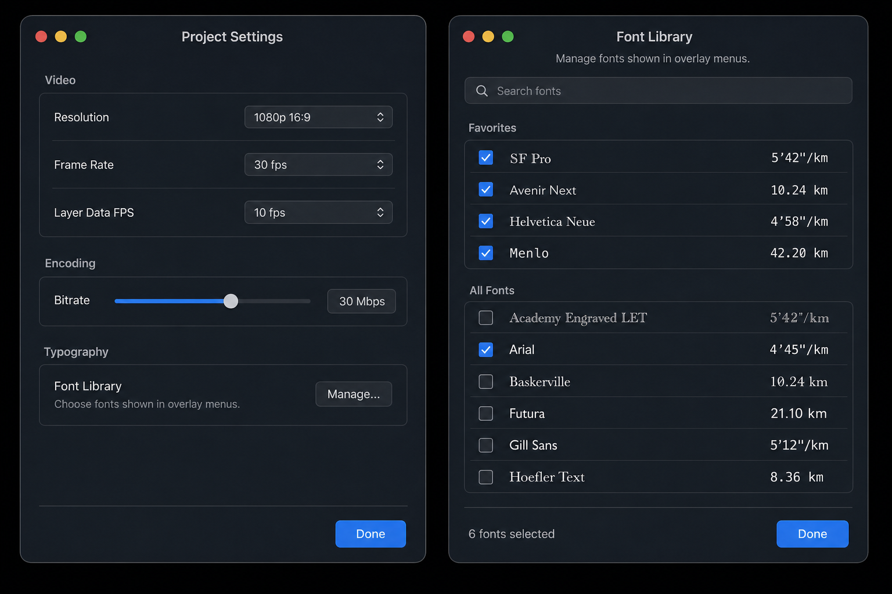
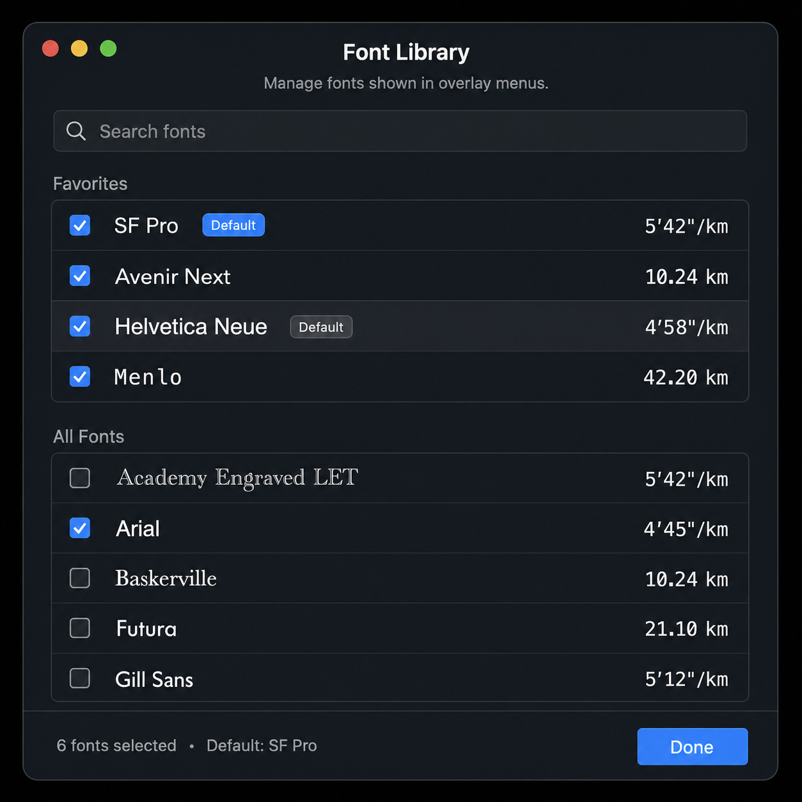
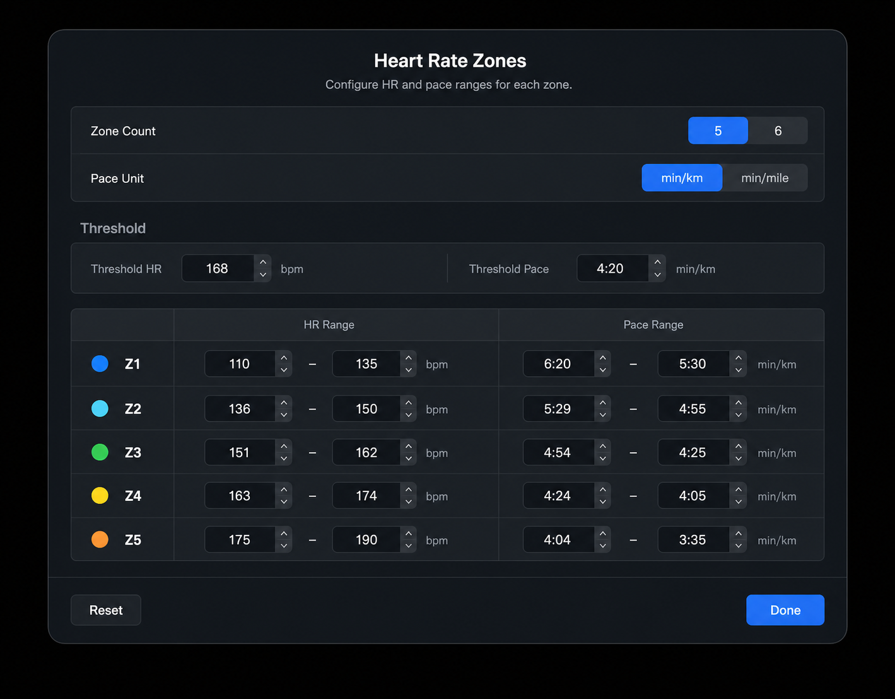

# Project Settings, Heart Rate Zones, And Font Library UI Spec

Last updated: 2026-06-22

## Purpose

This spec defines the Project Settings modal, Heart Rate Zones sheet, and Font Library management sheet. These surfaces share one macOS utility design language: dark translucent window chrome, centered modal titles, grouped sections, inset rows, subtle dividers, and blue primary actions.

Mockup reference:

Default font interaction reference:

Heart Rate Zones reference:

## Visual Language

- Use the same modal treatment for both windows: dark glassy panel, subtle border, large outer corner radius, and macOS traffic-light controls when presented as a standalone window mockup.
- Titles are centered at the top of the modal.
- Settings content is organized into section headers and bordered grouped boxes.
- Rows use stable heights, thin separators, left labels, and right-aligned controls.
- Primary actions use the app blue. Secondary buttons use raised dark control styling.
- Footer areas are separated from content by a divider and keep the primary `Done` button right-aligned.

## Project Settings Layout

The settings modal should include only the current project export/settings controls:

1. `Video`
   - `Resolution` dropdown with `1080p 16:9`.
   - `Frame Rate` dropdown with `30 fps`.
   - `Layer Data FPS` dropdown with `5 fps`.
2. `Typography`
   - `Font Library` row.
   - Caption: `Choose fonts shown in overlay menus.`
   - Right secondary button: `Manage...`.
3. `Physiology`
   - `Heart Rate Zones` row.
   - Caption: `Configure HR and pace ranges for overlays.`
   - Right secondary button: `Configure...`.
4. `Intervals`
   - `Interval Colors` row.
   - Caption: `Set the colors used for Warm Up, Active, Rest, and Cool Down.`
   - Right secondary button: `Configure...`.
5. `Weather`
   - `OpenWeather API Key` secure text field.
   - Caption: `Stored in macOS Keychain and used only for OpenWeather requests.`

The modal footer contains a right-aligned primary `Done` button.

Do not add unrelated settings such as project name, theme, notifications, hotkeys, opacity, or background controls unless those features are implemented and explicitly added to the settings model.

## Heart Rate Zones Layout

The Heart Rate Zones sheet configures the global HR and pace zone profile used by physiology-aware overlays.

Functional scope is intentionally limited to the controls already present in the app:

- Zone count segmented control: `5` / `6`.
- Pace unit segmented control: `min/km` / `min/mile`.
- Threshold fields: `Threshold HR` with `bpm`, and `Threshold Pace` with the selected pace unit.
- Editable zone rows with a colored zone dot, `Z1`...`Z5` or `Z6`, HR min/max fields, and pace min/max fields.
- Footer actions: secondary `Reset`, primary `Done`.

Do not add import, preview, auto-fill, purpose/category, timeline preview, profile management, or explanatory feature controls until those behaviors exist in the app model.

Structure:

1. Centered title: `Heart Rate Zones`.
2. Subtitle: `Configure HR and pace ranges for each zone.`
3. Grouped settings box with two stable rows:
   - `Zone Count`, trailing segmented control.
   - `Pace Unit`, trailing segmented control.
4. `Threshold` section header and one grouped row:
   - Left field group: `Threshold HR`, numeric field, `bpm`.
   - Right field group: `Threshold Pace`, pace field, selected pace unit.
5. Zone table grouped box:
   - Header columns: zone label area, `HR Range`, `Pace Range`.
   - Rows use subtle separators, fixed row height, aligned inputs, and unit text outside fields.
6. Footer divider, left `Reset`, right `Done`.

Zone colors:

| Zone | Color |
| --- | --- |
| Z1 | Blue |
| Z2 | Cyan |
| Z3 | Green |
| Z4 | Yellow |
| Z5 | Orange |
| Z6 | Red |

Zone row rules:

- Keep inputs compact and equal width.
- Use a simple dash between min and max fields.
- Keep `bpm` and pace-unit labels outside the input fields.
- Preserve a table-like layout; do not render each zone as a separate floating card.
- If `6` zones is selected, add the Z6 row using the same spacing and red dot.
- Text must remain English until the planned localization pass.

## Font Library Layout

The Font Library sheet manages the global favorite font list used by overlay font pickers.

Structure:

1. Centered title: `Font Library`.
2. Subtitle: `Manage fonts shown in overlay menus.`
3. Search field with magnifying glass and placeholder `Search fonts`.
4. `Favorites` grouped list.
5. `All Fonts` grouped list.
6. Footer with secondary `Restore Defaults`, selected count, and primary `Done` button.

Rows use checkbox selection rather than a trailing-only checkmark because this screen is a management surface, not a picker menu.

## Font Row Content

Every font row contains three aligned parts, plus an inline default action in the `Favorites` section:

- Checkbox at the leading edge.
- Font family name rendered in that family.
- Inline `Default` action immediately after the font family name when applicable.
- Numeric running preview rendered in the same family.

Examples:

| Family | Preview |
| --- | --- |
| `SF Pro` | `5'42"/km` |
| `Avenir Next` | `10.24 km` |
| `Helvetica Neue` | `4'58"/km` |
| `Menlo` | `42.20 km` |
| `Arial` | `4'45"/km` |

The numeric preview column must be right-aligned so users can compare how digits, decimal points, and pace notation look across fonts. Row height must remain stable even when font metrics vary.

## Default Font

The Font Library supports one default font selected from the favorite list.

Default display rules:

- The current default favorite shows a compact blue `Default` pill immediately after the font family name.
- Non-default favorites do not show the action by default.
- On row hover, a compact gray `Default` button appears in the same inline position after the font family name.
- Clicking the gray `Default` button makes that font the new default and turns its button blue.
- Do not use stars, trailing badges, or a separate default column.
- Reserve enough inline space after the family name so the row does not jump when the hover button appears.
- Keep the numeric preview column right-aligned independently from the inline `Default` action.

Default behavior:

- The default font must always be one of the favorite fonts.
- Removing the current default from favorites should promote the first remaining favorite to default.
- If no favorites remain, overlay pickers still use the fallback family list and the default resolves to the first fallback family.
- The footer should include both count and default, for example `4 fonts selected • Default: Menlo`.
- `Restore Defaults` resets favorites and the default font to the fallback favorite set.

## Behavior

- Search filters all system font families by localized case-insensitive family name.
- Toggling a checkbox adds or removes that family from favorites.
- `Favorites` shows selected fonts first.
- `All Fonts` shows searchable system font families and still reflects selected state.
- The footer count uses the raw selected count and current default, for example `4 fonts selected • Default: Menlo`.
- If the user clears all favorites, overlay font pickers fall back to the default set: `Menlo`, `PT Mono`, `Monaco`, `Andale Mono`.
- `Restore Defaults` clears any search filter so the restored favorites are visible immediately.

## Implementation Notes

- Use shared app tokens from [App UI Design System](../../system/app-ui.md).
- Prefer reusable grouped-section and row primitives instead of one-off styling in `ProjectSettingsView` and `FontLibraryView`.
- Keep control radii within the app system guidance: 6-8 px for controls and grouped boxes.
- Use monospaced or stable numeric rendering only where it does not conflict with the row's requirement to preview the selected font. In the Font Library list, the preview must use the row font.
- Avoid decorative copy or explanatory blocks inside the modal beyond the one Font Library subtitle and the Typography row caption.
