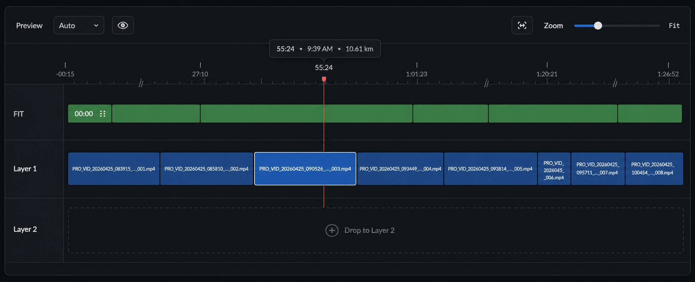

# Timeline UI Design Spec

Last updated: 2026-04-26

## Purpose

The Timeline is the bottom editing surface for video/FIT alignment, playback position, clip selection, clip movement, zoom, preview-track selection, and collapsed gap viewing. It should feel like a precise professional editor timeline while preserving the app's FIT-specific alignment model.

This spec is implementation-facing. Use it to refine `TimelineView` and `TimelineCanvasNSView`.

## Design Reference

## Scope

This design covers:

- Timeline header controls.
- Timeline ruler.
- Fixed label column.
- FIT activity layer.
- Video layers and clip blocks.
- Playhead.
- Drag/drop targets.
- Zoom and collapsed gap behavior.

Future features such as trim handles, snapping, markers, and waveforms are out of scope unless separately specified.

## Current Implementation Mapping

Current SwiftUI/AppKit entry points:

- `Sources/RunningOverlay/UI/TimelineView.swift`
- `Sources/RunningOverlay/Timeline/TimelineModel.swift`

Existing behavior to preserve:

- Preview track picker with `Auto` and track names.
- Per-track preview visibility menu.
- Collapse/expand toggle for hiding gaps without video.
- Zoom slider with nonlinear mapping and `Fit` label.
- Ruler seeking and hover data.
- FIT layer shown independently above video tracks.
- FIT layer can be dragged horizontally to align activity data.
- Video clips can be dragged horizontally in expanded mode.
- Collapsed mode hides no-video gaps and disables horizontal dragging of existing video clips.
- Red playhead spans visible timeline tracks and stays visible during playback.
- Media drag/drop creates or moves clips and exposes one new-layer target.
- Empty project shows no fake playhead, FIT layer, or track.
- FIT/media-ready empty timeline shows a default `Layer 1` drop lane.

## Layout

Top to bottom:

1. Timeline header.
2. Ruler.
3. FIT track, when FIT activity exists.
4. Video layers.
5. Optional drop target lane during media drag.

Left to right:

1. Fixed label column.
2. Scrollable time lane area.

## Header

Left controls:

- Label: `Preview`
- Eye icon button for preview track visibility.

The previous explicit `Auto` preview-track picker was removed; preview track auto-selection is now implicit and per-track visibility is controlled exclusively by the eye-icon menu.

Right controls:

- Collapse/expand gaps icon button.
- Label: `Zoom`
- Zoom slider.
- Zoom value label, e.g. `Fit`.

Rules:

- Do not add a separate `Gaps hidden` row, status band, or extra text row.
- Gap visibility/collapsed mode is controlled by the header icon only.
- The collapse icon active state may use `accent.blue` or a stronger control background.
- Header height follows app-level panel header sizing.

## Ruler

The ruler communicates project display time, including pre-activity and post-activity spans.

Requirements:

- Support negative pre-start labels such as `-00:15`.
- Support activity labels such as `27:10`, `55:24`, `1:01:23`.
- Support post-finish labels such as `1:20:21`, `1:26:52`.
- Ticks should be subtle and evenly aligned to the time scale.
- Hover data appears as a compact pill in a reserved band above the time scale, e.g. `55:24 • 9:39 AM • 10.61 km`.
- The hover pill has a small downward-pointing arrow on its bottom edge whose tip aligns with the hovered ruler position, so the pill reads as a tooltip pointing down to the time scale without sitting under the cursor.

## Label Column

The label column is fixed while the time lanes scroll.

Labels:

- `FIT`
- `Layer 1`
- `Layer 2`
- Additional layer names from timeline tracks.

Rules:

- Use a slightly different background from lane area.
- Separate from lanes with a vertical divider.
- Keep labels compact and readable.
- Highlight a drop target label subtly during drag-over.

## FIT Track

The FIT track represents the activity data layer.

Visual:

- Green bar spanning activity duration.
- Start block or label near the beginning, e.g. `00:00`.
- Dark block borders consistent with clip splice edges.

Behavior:

- The FIT layer can be dragged horizontally to change `fitStartTime`.
- The design should hint that it is an alignable axis, not a normal video clip.
- In collapsed mode, FIT-only regions without video may be hidden according to current model behavior.

## Video Tracks And Clips

Clip visual:

- Blue blocks on dark track bands.
- Width is proportional to actual duration at current zoom, including Fit view.
- Adjacent internal clip edges are square, with dark splice borders.
- Avoid pill-shaped adjacent clips.
- Clip labels are clipped or middle-truncated inside blocks.
- Hide labels if a clip is too narrow.

Selection:

- Selected clip uses a crisp 2 px white border around the clip block.
- Selection border should not overpower the clip fill or playhead.

Track background:

- Alternating dark bands.
- Thin horizontal separators.
- Clear lane boundaries without heavy grid lines.

## Playhead

The playhead must be visible but not visually aggressive.

Visual:

- Full-height vertical line in muted red/coral, starting from inside the ruler band and extending down through all visible tracks.
- Small downward-pointing triangle at the top, sitting inside the ruler band so the playhead does not extend above the ruler.
- The triangle's tip connects directly to the vertical line so the marker reads as one continuous cursor.
- Use `#E4525A` or similarly muted red, with lower opacity on the line where appropriate.

Rules:

- Do not use a large bright red arrowhead.
- Do not let the playhead head/line stick out above the top of the ruler.
- Do not use a square or rectangular block as the marker; use a downward triangle.
- The playhead should read as an editing cursor, not a warning marker.

## Collapsed Gap Mode

Collapsed mode hides gaps without video.

Visual:

- Communicate collapsed state through the header icon active state.
- Do not allocate a separate status row.
- Clip blocks may appear joined back-to-back with dark splice borders.
- Optional compressed-gap markers should be subtle and only used if they clarify display-time discontinuity.

Interaction:

- Playback skips hidden empty regions.
- Existing clips cannot be dragged horizontally in collapsed mode.
- Users should expand the timeline before timing edits that need full time context.

## Drag And Drop

Media drag-over state:

- Highlight the target layer lane.
- Expose exactly one new-layer target beyond existing layers.
- Use a subtle dashed outline or translucent fill.
- Label may read `Drop to Layer 2` or `New Layer`.

Rules:

- Drop target should not look like a real clip before drop.
- Drag feedback should not obscure the playhead or existing clips.

## Interaction Rules

- Ruler click/drag seeks the playhead.
- Clip click selects the clip.
- Expanded-mode clip drag changes effective start time.
- Collapsed-mode clip drag is disabled, but selection still works.
- FIT track drag changes FIT alignment.
- Command-scroll and pinch zoom the timeline.
- Zoom changes keep the playhead visible and recenter on it.
- During playback, the timeline scrolls to keep the playhead visible.
- Delete and Forward Delete remove selected timeline clips when the canvas has focus.

## Component Guidance

Recommended components:

- `TimelinePanel`
- `TimelineHeader`
- `TimelinePreviewTrackPicker`
- `TimelineTrackVisibilityMenu`
- `TimelineCollapseButton`
- `TimelineZoomControl`
- `TimelineRuler`
- `TimelineLabelColumn`
- `TimelineFitTrack`
- `TimelineClipBlock`
- `TimelinePlayhead`
- `TimelineDropTarget`
- `TimelineHoverInfoPill`

Rendering can remain AppKit-based for precision. Apply the shared `EditorTheme` colors and measurements consistently in drawing code.

## Accessibility

- Header controls need labels and `.help(...)`.
- Collapse button help should switch between `Hide gaps without video` and `Show timeline gaps`.
- Clip labels need accessible titles when text is clipped.
- Timeline canvas should become first responder on click so shortcuts are delivered correctly.
