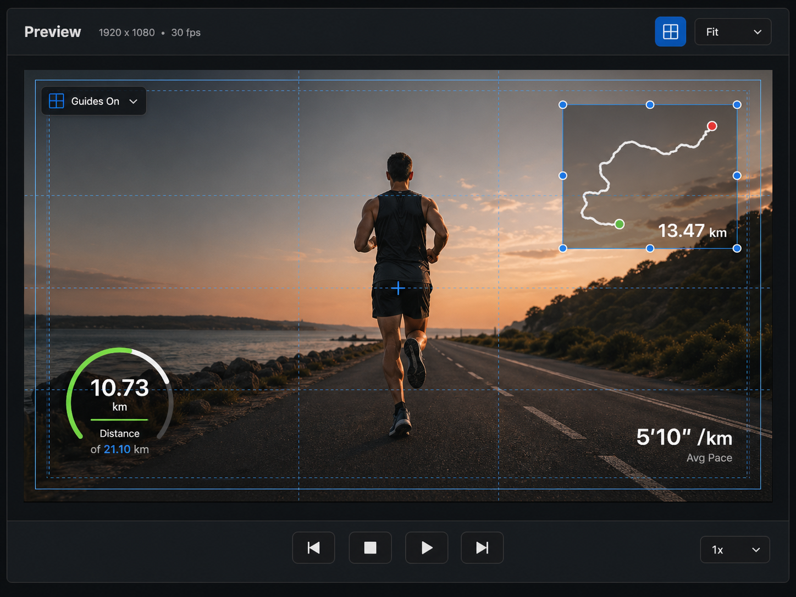

# Preview UI Design Spec

Last updated: 2026-04-26

## Purpose

The Preview is the central editing surface for video playback and overlay placement. It should own preview-specific controls, including the safe guides toggle. The safe guides control should no longer live beside Export in the app-level toolbar.

This spec is implementation-facing. Use it to update `PreviewCanvasView` and the main toolbar interaction split.

## Design Reference

## Scope

This design covers the middle Preview panel only:

- Preview title and project display metadata.
- In-preview safe guides control.
- Fit dropdown.
- Video canvas and overlay editing affordances.
- Single-row playback controls.

Explicitly out of scope for this Preview revision:

- Preview timeline scrubber.
- Playback timecode text.
- Fullscreen control.
- Background/checker toggle.
- Overlay visibility toggle.
- Export actions.

## Current Implementation Mapping

Current SwiftUI entry points:

- `Sources/RunningOverlay/UI/PreviewCanvasView.swift`
- `Sources/RunningOverlay/UI/MainEditorView.swift`

Current behavior to migrate:

- `project.showPreviewGuides` is currently toggled from `MainEditorView.toolbar`, beside Export.
- Move that toggle into the Preview panel header.
- Keep Export as an app-level action in the main toolbar.

Existing behavior to preserve:

- Video preview playback.
- Media-pool source preview vs timeline playhead preview behavior.
- Overlay rendering on the fitted canvas.
- Overlay selection by clicking elements.
- Overlay dragging with normalized canvas coordinates.
- Clearing media-pool preview and selection when clicking empty canvas.
- Safe guide rendering through `PreviewSafetyGuidesView`.
- Existing playback actions: previous, stop, play/pause, next, and playback rate.

## Layout

Top to bottom:

1. Preview header
2. Canvas workspace
3. Bottom playback row

The Preview panel should use app-level dark editor styling from [App UI Design System](./app-ui.md).

### Preview Header

Left side:

- Title: `Preview`
- Metadata: `1920 x 1080 • 30 fps`

Right side:

- Safe guides icon button, active when `project.showPreviewGuides == true`
- Fit dropdown, labeled `Fit`

No other controls in this revision.

Header rules:

- Height: 44-52 px.
- Background: `panel.header` or `app.chrome`.
- Bottom border: `border.subtle`.
- Safe guides active state uses `accent.blue` foreground and/or `accent.blue.soft` background.
- Fit dropdown is a compact menu button, not a large segmented control.

Implementation notes:

- Resolution should come from `project.settings.resolution`.
- Frame rate should come from project settings or export/preview settings if available. If no model-backed frame rate is available, show only resolution until frame rate exists.
- The Fit dropdown can start as a fixed visual control if zoom modes are not implemented, but it should not imply saved unsupported state.

### Canvas Workspace

The canvas workspace is the dark region that centers the fitted project-resolution video frame.

Rules:

- The fitted canvas remains 16:9 or the selected project aspect ratio.
- Canvas should stay centered in available space.
- Use `app.bg` or `app.chrome` around the frame.
- Empty video state remains inside the canvas area.
- Overlays render and interact in project-canvas coordinates, not outer panel coordinates.

Safe guides:

- When enabled, draw guide overlays on top of video and below interactive overlay handles.
- Include safe-area rectangles and center guides.
- Guides should be thin, subtle, and non-interactive.
- Use blue/cyan with low opacity. Do not make guides look decorative.

Optional canvas HUD:

- A compact `Guides On` HUD can appear near the canvas top-left while guides are enabled.
- Keep it subtle and non-blocking.
- It may be omitted in implementation if the active toolbar state is sufficient.

Overlay editing affordances:

- Selected overlay gets a subtle blue selection border and small corner handles.
- Handles should be visible but not oversized.
- Non-selected overlays should not show handles.
- Row/action controls outside the canvas should not overlap overlay handles.

### Bottom Playback Row

The Preview bottom area is a single row.

Centered playback cluster:

- Previous
- Stop
- Play/Pause
- Next

Bottom-right speed control:

- Compact dropdown/button labeled `1x`.
- Use the current playback rate.

Do not show:

- Timecode.
- Playback time text.
- Scrubber/progress bar.
- Preview-local timeline.

Rules:

- Row height: 44-52 px.
- Playback cluster is visually centered in the panel, independent of the speed control.
- Speed control is pinned to the right with panel padding.
- Buttons use the shared icon-button style.
- Play/Pause can be slightly emphasized, but should stay compact.

## Interaction Rules

- Safe guides button toggles `project.showPreviewGuides`.
- Fit dropdown controls preview zoom/fitting behavior when model support exists. Until then, `Fit` can be static or omitted from interaction.
- Previous/stop/play-pause/next buttons call existing playback commands.
- Speed control maps to playback rate controls. If only `L` cycling exists, the UI can expose current rate and a simple menu later.
- Clicking empty canvas clears overlay selection and clears media-pool preview, preserving current behavior.
- Clicking an overlay selects it and opens the Inspector detail state.
- Dragging an overlay updates normalized position and commits undo grouping at drag end.

## Component Guidance

Recommended components:

- `PreviewPanel`
- `PreviewHeader`
- `PreviewMetadataLabel`
- `PreviewSafeGuidesButton`
- `PreviewFitMenu`
- `PreviewCanvasWorkspace`
- `PreviewCanvasHUD`
- `PreviewPlaybackBar`
- `PreviewPlaybackButton`
- `PreviewRateMenu`

Use shared app components where available:

- `EditorIconButton`
- `EditorPanelHeader`
- `EditorStatusPill`

## App Toolbar Change

Remove the safe guides toggle from the app-level toolbar in `MainEditorView`.

App toolbar should keep:

- FIT import.
- Video import.
- Export progress.
- Export action.

Preview-specific controls should live in the Preview panel.

## Accessibility

- Safe guides button needs `.help("Show Safe Frames")` or equivalent.
- Fit dropdown needs a label such as `Preview Zoom`.
- Playback buttons need labels: Previous, Stop, Play, Pause, Next.
- Speed control needs label: `Playback Speed`.
- Guide lines should not interfere with hit testing.

