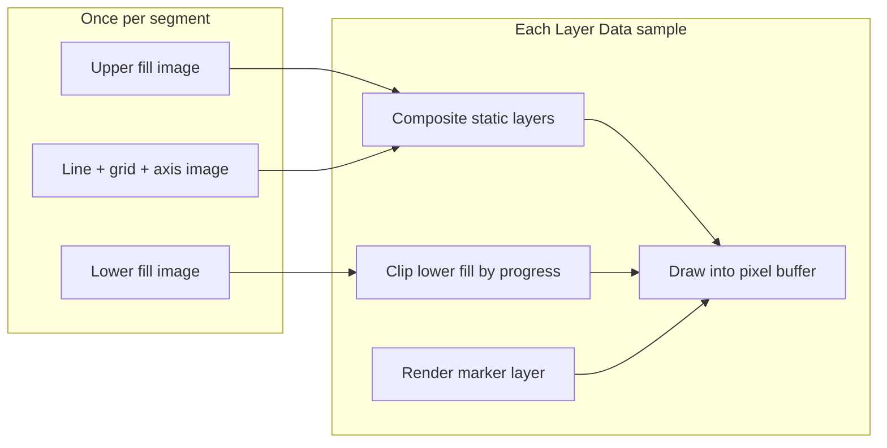

# Elevation Chart Stats Bar Parity & Export Optimization Plan

> **For agentic workers:** REQUIRED SUB-SKILL: Use superpowers:subagent-driven-development (recommended) or superpowers:executing-plans to implement this plan task-by-task. Steps use checkbox (`- [ ]`) syntax for tracking.

**Goal:** Fix Elevation Chart Stats Bar preview/export visual parity, then reduce export cost for elevation charts (especially Dark Terrain / dual-area) via static fill caching and progress-mode-aware reuse.

**Architecture:** Phase 1 moves Stats Bar geometry and typography into `OverlayRenderModel` (same pattern as Distance Timeline / Route Map) so preview and export share scaled layout fields. Phase 2 adds Route-Map-style static fill pre-rendering in `SwiftUIOverlayVideoExporter` for `fullProfile` charts, compositing dual-area lower fill with a cheap per-frame clip. Phase 3 precomputes per-sample chart geometry for `progressToCurrent` and caches raster output keyed by Layer Data sample time.

**Tech Stack:** Swift 6, SwiftUI (`ImageRenderer`), `OverlayRenderModel`, Swift Testing, `./scripts/check.sh`, local `--benchmark-export` snapshots.

**Branch:** `feature/elevation-chart-export-optimization` from `develop` (sibling worktree per `AGENTS.md`).

**Human review required:** export render-path changes, timing-domain sampling, visual parity.

---

## Background

| Problem | Root cause |
|---------|------------|
| Stats Bar looks wrong in export vs preview | `ElevationChartOverlayView` uses raw `style.statsBar.*` design points; chart card uses `context.scaled()` |
| Multiple elevation charts slow export | Each chart is a dynamic overlay → separate `ImageRenderer` pass per frame |
| Dark Terrain hard to optimize | Dual-area mask moves every frame; `progressToCurrent` also changes path geometry |

Reference implementations:

- Stats Bar layout: `OverlayDistanceTimelineRenderLayout.distanceTimelineStatsBarRect()` (`OverlayRenderModel.swift`)
- Static export cache: `ExportRenderPlan.canUseRouteMapStaticCache` + `routeMapStaticLayerCache` (`SwiftUIOverlayVideoExporter.swift`)

---

## File Map

| File | Responsibility |
|------|----------------|
| `Sources/RunningOverlay/Overlay/OverlayRenderModel.swift` | Add `OverlayElevationChartStatsBarLayout`, scaled stats bar rect, fix `chartVerticalReserve` |
| `Sources/RunningOverlay/UI/PreviewCanvasView.swift` | `ElevationChartOverlayView` consumes layout stats bar fields |
| `Sources/RunningOverlay/Export/SwiftUIOverlayVideoExporter.swift` | Static fill cache eligibility, pre-render, per-frame composite |
| `Sources/RunningOverlay/UI/OverlaySharedViews.swift` | Optional render flags on shared elevation chart wrapper |
| `Tests/RunningOverlayTests/OverlayRenderModelTests.swift` | Layout scaling / rect tests |
| `Tests/RunningOverlayTests/ExportPerformanceTests.swift` | Cache eligibility + render-plan tests |
| `docs/overlay-modules/elevation-chart-overlay.md` | Update export path + stats bar scaling note |
| `docs/development/export.md` | Document elevation chart static fill cache rules |
| `docs/project-log/2026-06.md` | Record shipped phases |

---

## Phase 1 — Stats Bar Preview/Export Parity

**Scope:** Correctness only. No export performance changes.

**Acceptance criteria:**

- Stats Bar width, height, offsets, font sizes, and item spacing scale with canvas resolution the same way Distance Timeline stats bar does.
- `Inside` stats bar no longer overlaps chart line; outside stats bar gap scales.
- Preview at fitted canvas and export at project resolution look proportionally identical (stats bar relative to chart card).
- `./scripts/check.sh` passes.

### Task 1.1: Add scaled Stats Bar layout to render model

**Files:**
- Modify: `Sources/RunningOverlay/Overlay/OverlayRenderModel.swift`
- Test: `Tests/RunningOverlayTests/OverlayRenderModelTests.swift`

- [ ] **Step 1: Write failing tests**

Add tests (follow `elevationChartInsideStatsBarReservesChartClearance` style):

```swift
@Test func elevationChartStatsBarRectScalesWithCanvasSize() {
    var style = OverlayStyle.default
    style.elevationChart.statsBar.visible = true
    style.elevationChart.statsBar.height = 44
    style.elevationChart.statsBar.valueFontSize = 18
    let element = OverlayElement(type: .elevationChart, position: CGPoint(x: 0.5, y: 0.5), scale: 1, style: style)
    let activity = ProjectDocument.calibrationActivity()

    let hd = OverlayRenderModel.elevationChartLayout(
        for: element,
        in: OverlayRenderContext(canvasSize: CGSize(width: 1280, height: 720), activity: activity, elapsedTime: 10)
    )
    let sd = OverlayRenderModel.elevationChartLayout(
        for: element,
        in: OverlayRenderContext(canvasSize: CGSize(width: 640, height: 360), activity: activity, elapsedTime: 10)
    )

    let hdBar = try #require(hd.statsBarLayout)
    let sdBar = try #require(sd.statsBarLayout)
    #expect(hdBar.rect.height == sdBar.rect.height * 2)
    #expect(hdBar.valueFontSize == sdBar.valueFontSize * 2)
}

@Test func elevationChartInsideStatsBarUsesScaledReserve() {
    // chartHeight at 1280 should reserve scaled(statsBar.height + gap), not raw design points
}
```

- [ ] **Step 2: Run focused tests — expect FAIL**

```sh
./scripts/test.sh elevationChartStatsBar
```

- [ ] **Step 3: Implement layout struct**

Add `OverlayElevationChartStatsBarLayout` (mirror `OverlayRouteMapStatsBarLayout` surface used by `SharedStatsBarContentView`):

```swift
struct OverlayElevationChartStatsBarLayout {
    var rect: CGRect          // local to elevation chart card (0…card size)
    var items: [OverlayDistanceTimelineStatsBarItemLayout]
    var stacked: Bool
    var itemSpacing: Double
    var dividerOpacity: Double
    var cornerRadius: Double
    var backgroundOpacity: Double
    var valueFontName: String
    var valueFontSize: Double
    var valueFontWeight: OverlayFontWeight
    var valueColor: OverlayColor
    var labelFontName: String
    var labelFontSize: Double
    var labelFontWeight: OverlayFontWeight
    var labelColor: OverlayColor
}
```

Add to `OverlayElevationChartRenderLayout`:

```swift
var statsBarLayout: OverlayElevationChartStatsBarLayout?
```

Add extension:

```swift
extension OverlayElevationChartRenderLayout {
    var elevationChartStyleScale: Double { rect.width / max(style.width, 1) }
}
```

In `elevationChartLayout(for:in:)`:

1. Compute `scale = rect.width / max(style.width * element.scale, 1)` (or use `context.canvasScale * element.scale` consistently with other overlays).
2. Replace raw `chartVerticalReserve`:

```swift
let scaledStatsBarHeight = style.statsBar.visible
    ? context.scaled(style.statsBar.height * element.scale)
    : 0
let chartVerticalReserve = style.statsBar.visible && style.statsBar.inside
    ? scaledStatsBarHeight + context.scaled(8 * element.scale)
    : 0
```

3. Build `statsBarLayout` when visible and items non-empty:

```swift
let barWidth = style.statsBar.width > 0
    ? min(context.scaled(style.statsBar.width * element.scale), rect.width - horizontalPadding * 2)
    : rect.width - horizontalPadding * 2
let barHeight = context.scaled(style.statsBar.height * element.scale)
let offsetX = context.scaled(style.statsBar.offsetX * element.scale)
let offsetY = context.scaled(style.statsBar.offsetY * element.scale)
let gap = context.scaled(8 * element.scale)

let centerX = rect.width / 2 + offsetX
let centerY = style.statsBar.inside
    ? rect.height - verticalPadding - barHeight / 2 + offsetY
    : rect.height + gap + barHeight / 2 + offsetY

let localRect = CGRect(
    x: centerX - barWidth / 2,
    y: centerY - barHeight / 2,
    width: barWidth,
    height: barHeight
)
```

Populate scaled font/spacing fields from `style.statsBar` via `context.scaled(... * element.scale)`.

- [ ] **Step 4: Run tests — expect PASS**

```sh
./scripts/test.sh elevationChartStatsBar
```

- [ ] **Step 5: Commit**

```sh
git commit -m "Fix elevation chart stats bar layout scaling in render model."
```

### Task 1.2: Wire preview view to layout stats bar

**Files:**
- Modify: `Sources/RunningOverlay/UI/PreviewCanvasView.swift` (`ElevationChartOverlayView`)

- [ ] **Step 1: Replace raw style usage**

Remove `statsBarWidth`, `statsBarCenterY`, and raw `statsBarContent` style reads.

```swift
if let statsBar = layout.statsBarLayout {
    SharedStatsBarContentView(
        items: statsBar.items.map { ... },
        stacked: statsBar.stacked,
        itemSpacing: statsBar.itemSpacing,
        // ... all fields from statsBar layout
    )
    .frame(width: statsBar.rect.width, height: statsBar.rect.height)
    .position(x: statsBar.rect.midX, y: statsBar.rect.midY)
}
```

- [ ] **Step 2: Manual check**

Run app; compare Premium Gradient preset with visible stats bar at editor preview size vs **Export Test Frame** PNG at 1280×720 and 1920×1080.

- [ ] **Step 3: Run full tests**

```sh
./scripts/check.sh
```

- [ ] **Step 4: Update docs**

- `docs/overlay-modules/elevation-chart-overlay.md`: change export path to `SwiftUIOverlayVideoExporter` / `OverlaySharedElevationChartView`; note stats bar uses shared scaled layout.
- `docs/project-log/2026-06.md`: Phase 1 entry.

- [ ] **Step 5: Commit**

```sh
git commit -m "Use scaled elevation chart stats bar layout in preview and export."
```

### Phase 1 exit gate

- [ ] Export Test Frame PNG matches preview proportions for stats bar (inside + outside).
- [ ] No changes to `OverlayFrameRenderer` required (legacy test renderer can be updated in a follow-up if visual regression tests drift).

---

## Phase 2 — Static Fill Cache (Full Profile + Dark Terrain)

**Scope:** Export performance. Preview unchanged (still live SwiftUI).

**Prerequisite:** Phase 1 merged.

**Eligibility (`canUseElevationChartStaticFillCache`):**

| Condition | Required |
|-----------|----------|
| `element.type == .elevationChart` | yes |
| `style.progressMode == .fullProfile` | yes |
| `style.fillEnabled && style.chartStyle == .area` | yes |
| Activity has elevation samples | yes |
| `style.statsBar.visible` with non-empty items | **no** (v1 — same conservative rule as Route Map) |
| `style.bigNumbersEnabled` | **no** (dynamic metric text) |

Marker, marker label, glow, and dual-area mask remain dynamic.

**Static cache contents (baked once per export segment):**

1. Card chrome: background, border, container shadow (if cheap to include; otherwise bake chart area only).
2. Grid, axis line, axis labels (min/max/unit — static in full profile).
3. **Upper fill** (full area path) — always static.
4. **Lower fill** (full area path, dual-area only) — stored as separate image; not masked at bake time.
5. Chart line + optional glow (static in full profile).

**Per-frame dynamic pass (small `ImageRenderer` or CG composite):**

1. Clip-draw lower fill from `progressX` to chart right edge (dual-area).
2. Current marker + playhead line + value label.
3. Skip stats bar / big numbers (excluded by eligibility).



### Task 2.1: Add render flags to elevation chart view

**Files:**
- Modify: `Sources/RunningOverlay/UI/PreviewCanvasView.swift` (`ElevationChartOverlayView`)
- Modify: `Sources/RunningOverlay/UI/OverlaySharedViews.swift`

- [ ] **Step 1: Add parameters with preview-safe defaults**

```swift
struct OverlaySharedElevationChartView: View {
    // existing fields
    var showsChartFill = true
    var showsChartLine = true
    var showsCurrentMarker = true
    var showsStatsBar = true
    var showsBigNumbers = true
    var showsAxisDecor = true
    var dualAreaMaskProgress: Double? = nil // nil = render both fills unmasked (bake lower)
}
```

Guard corresponding sections in `ElevationChartOverlayView.body`.

For dual-area dynamic composite, when `dualAreaMaskProgress` is non-nil, apply existing mask using that progress; when `nil` during lower-fill bake, draw lower fill without mask.

- [ ] **Step 2: Verify preview defaults unchanged**

```sh
./scripts/test.sh OverlayRenderModelTests/elevationChart
```

- [ ] **Step 3: Commit**

```sh
git commit -m "Add elevation chart layer visibility flags for export static caching."
```

### Task 2.2: Export static cache plumbing

**Files:**
- Modify: `Sources/RunningOverlay/Export/SwiftUIOverlayVideoExporter.swift`
- Test: `Tests/RunningOverlayTests/ExportPerformanceTests.swift`

- [ ] **Step 1: Write eligibility tests**

```swift
@Test func renderPlanEnablesElevationChartStaticFillCacheForFullProfileDualAreaWithoutStatsBar() { ... }

@Test func renderPlanDisablesElevationChartStaticFillCacheForProgressMode() { ... }

@Test func renderPlanDisablesElevationChartStaticFillCacheWhenStatsBarVisible() { ... }
```

- [ ] **Step 2: Extend `ExportOverlayRenderItem`**

```swift
var usesElevationChartStaticFillCache: Bool
```

Add `canUseElevationChartStaticFillCache(for:context:)` to `ExportRenderPlan`.

- [ ] **Step 3: Add cache struct**

```swift
struct ElevationChartStaticFillCache {
    var baseContent: ExportOverlayRenderedImage      // upper fill + line + grid + axis + chrome
    var lowerFill: ExportOverlayRenderedImage?       // dual-area only
    var chartContentRect: CGRect                     // local clip rect within overlay
}
```

- [ ] **Step 4: Pre-render at segment start**

Mirror `routeMapStaticLayerCache` loop:

- `renderElevationChartLayer(..., showsChartFill: true, showsCurrentMarker: false, showsStatsBar: false, showsBigNumbers: false, dualAreaMaskProgress: nil, fillVariant: .upperOnly)`
- If `dualAreaEnabled`, second bake with `fillVariant: .lowerOnly`

Implement `renderElevationChartLayer` analogous to `renderRouteMapLayer` using new `SwiftUIElevationChartLayerView`.

- [ ] **Step 5: Per-frame composite in `usesPerOverlayRender` branch**

```swift
if item.usesElevationChartStaticFillCache, let cache = elevationChartStaticFillCache[item.id] {
    // draw cache.baseContent
    // clip-draw cache.lowerFill from progressX
    // renderElevationChartLayer(marker only)
} else {
    // existing full renderLayer path
}
```

Prefer `CGContext` clip + `draw(cgImage:)` for mask composite; avoid third full `ImageRenderer` when marker can be isolated in a small layer (same strategy as route map marker pass).

- [ ] **Step 6: Profile before merge**

```sh
swift run RunningOverlay --benchmark-export <snapshot.json> --benchmark-output /tmp/elev-bench-phase2
```

Compare `imageRenderDuration`, `elevationChart` overlay stats, and total segment duration vs Phase 1 baseline. **Do not merge if regression > 5% on snapshots without stats bar.**

- [ ] **Step 7: Commit + docs**

Update `docs/development/export.md` eligibility bullets; project log entry.

---

## Phase 3 — Progress Mode Sample Cache

**Scope:** `progressToCurrent` exports where path length grows per sample.

**Prerequisite:** Phase 2 merged and benchmarked.

**Problem:** `visibleSamples` prefix changes → smoothed path changes globally → cannot reuse Phase 2 full-path static images.

**Strategy (conservative v1):**

1. **CPU precompute** at segment start: for each Layer Data sample index `i`, compute `OverlayElevationChartRenderLayout` with `elapsedTime` at that sample (includes smoothed prefix samples). Store in `[TimeInterval: OverlayElevationChartRenderLayout]` or array indexed by sample frame.
2. **Raster reuse:** keyed by `sampleElapsed` (already partially exists via `previousSampleElapsed`). Ensure elevation chart benefits when video FPS > Layer Data FPS.
3. **Optional bounded raster cache** for `progressToCurrent`: pre-render full overlay image for each unique `sampleElapsed` during segment (memory cap: `min(sampleCount, 300)`; fall back to live render beyond cap).

Do **not** attempt incremental path tessellation while `smoothingEnabled` — smoothing is global over visible prefix.

### Task 3.1: Segment sample layout precompute

**Files:**
- Create: `Sources/RunningOverlay/Export/ElevationChartExportSampleCache.swift` (if file grows; otherwise private methods on exporter)
- Modify: `Sources/RunningOverlay/Export/SwiftUIOverlayVideoExporter.swift`
- Test: `Tests/RunningOverlayTests/ExportPerformanceTests.swift`

- [ ] **Step 1: Test precompute key coverage**

```swift
@Test func elevationChartSampleCacheCoversQuantizedLayerDataFrames() {
    let samples = SwiftUIOverlayVideoExporter.frameSamples(...)
    let cache = ElevationChartExportSampleCache.make(
        element: element, activity: activity, canvasSize: size, samples: samples
    )
    #expect(cache.layouts.count == Set(samples.map(\.sampleElapsed)).count)
}
```

- [ ] **Step 2: Implement cache builder off hot path**

Run layout + sample smoothing in `autoreleasepool` on background task; keep `ImageRenderer` on `MainActor`.

- [ ] **Step 3: Wire exporter to use cached layouts**

Pass precomputed layout into `OverlaySharedElevationChartView` when available.

- [ ] **Step 4: Benchmark progressToCurrent fixture**

Separate snapshot with `progressMode: progressToCurrent`, `dualAreaEnabled: true`.

- [ ] **Step 5: Commit + docs**

Document memory/limit behavior in `docs/development/export.md`.

### Task 3.2 (optional): Per-sample raster cache for progress mode

Only implement if Phase 3.1 benchmark shows layout precompute alone is insufficient.

- [ ] Cap cache size; profile memory in `export_profile_*.json` (add `elevationChartRasterCacheEntries` metric).
- [ ] Benchmark proves net win vs CPU-only path.

---

## Testing Matrix

| Case | Phase | Test type |
|------|-------|-----------|
| Stats bar scales 640 vs 1280 | 1 | `OverlayRenderModelTests` |
| Inside bar clears chart | 1 | existing + updated assertion |
| Stats bar preview ≈ export frame PNG | 1 | manual + future visual snapshot |
| Static cache eligibility | 2 | `ExportPerformanceTests` |
| Dual-area export benchmark | 2 | `--benchmark-export` |
| Progress mode sample cache keys | 3 | unit test |
| Multi elevation chart project | 2–3 | manual benchmark snapshot |

---

## Risks & Mitigations

| Risk | Mitigation |
|------|------------|
| Extra `ImageRenderer` passes hurt performance (Distance Timeline lesson) | Benchmark each phase; prefer CG clip composite over additional full-layer renders |
| Stats bar exclusion limits cache hit rate | Phase 2.1 eligibility; Phase 2.5 follow-up could split stats bar like Route Map future work |
| `ImageRenderer` blur/glow parity drift | Keep glow in static layer; marker blur stays dynamic |
| Memory from per-sample raster cache | Hard cap + opt-in Task 3.2 |

---

## Suggested PR Split

1. **PR 1 (Phase 1):** Stats bar scaling only — small, easy review, immediate user-visible fix.
2. **PR 2 (Phase 2):** Static fill cache + benchmarks — request human review per `AGENTS.md`.
3. **PR 3 (Phase 3):** Progress mode caches — only after benchmark evidence.

---

## Definition of Done (all phases)

- [ ] `./scripts/check.sh` passes
- [ ] Focused tests added/updated per phase
- [ ] Relevant `docs/` updated (`elevation-chart-overlay.md`, `export.md`, `project-log/2026-06.md`)
- [ ] Benchmark comparison recorded in project log for Phase 2+
- [ ] Final report lists behavior changes, validation performed, known limitations (e.g. stats bar visible disables static cache in v1)
